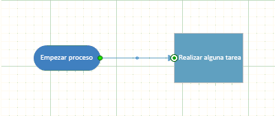

# <a name="manipulate-the-visio-file-format-programmatically"></a>Manipular mediante programación el formato de archivo de Visio


  
Obtenga información sobre cómo crear una solución en Visual Studio 2012 para leer el nuevo paquete de formatos de archivo en Visio 2013, seleccione elementos en el paquete, cambiar los datos en un elemento y agregar nuevos elementos para el paquete.
  
|||
|:-----|:-----|
|**En este artículo** [Fundamentos de manipulación de formato de archivo de Visio](#vis15_ManipulateFF_Essentials) [Crear un archivo .vsdx y una nueva solución de Visual Studio](#vis15_ManipulateFF_CreateFile) [Abrir un archivo de Visio 2013 como un paquete](#vis15_ManipulateFF_OpenPackage) [Seleccione y leer elementos del paquete de un paquete](#vis15_ManipulateFF_SelectPart) [Seleccione y cambiar los datos XML en una parte del paquete](#vis15_ManipulateFF_ChangeXML) [Volver a calcular datos en el archivo](#vis15_ManipulateFF_Recalculate) [Agregar un nuevo elemento de paquete a un paquete](#vis15_ManipulateFF_AddNewPart) [Agradecimientos](#vis15_ManipulateFF_Ackn) [Recursos adicionales](#vis15_ManipulateFF_Additional)                                                                                         ||
   
## <a name="visio-file-format-manipulation-essentials"></a>Conceptos básicos de la manipulación del formato de archivo de Visio
<a name="vis15_ManipulateFF_Essentials"> </a>

Versiones anteriores de Visio guardan los archivos en un formato de archivo binario propietario (.vsd) o un formato de archivo de dibujo de Visio XML (.vdx) de un solo documento. Visio 2013 presenta un nuevo formato de archivo (.vsdx), que se basa en tecnologías de archivo XML y ZIP. Al igual que en versiones anteriores de Visio, los archivos se guardan en un único contenedor. A diferencia de los archivos heredados, sin embargo, el nuevo formato de archivo puede ser abre, leer, actualizado, cambiado y construido sin automatización de la aplicación de Visio 2013. Los programadores que están familiarizados con la manipulación de XML o trabajar con el espacio de nombres [System.IO.Packaging](https://msdn.microsoft.com/library/System.IO.Packaging.aspx) rápidamente empezar a trabajar mediante programación con el nuevo formato de archivo. Los programadores que han trabajado con el formato de dibujo XML de Visio desde las versiones anteriores pueden encontrar muchas de las estructuras de dicho formato se han conservado en el nuevo formato de archivo. 
  
En este artículo, analizaremos cómo trabajar mediante programación, con el formato de archivo de Visio 2013 using the Microsoft .NET Framework 4.5, C# o Visual Basic y Visual Studio 2012. Puede ver cómo abrir un archivo de Visio 2013, seleccione partes del documento dentro del archivo, cambiar los datos en elementos y crear un nuevo elemento de documento.
  
> [!NOTE]
> Los ejemplos de código en este artículo se suponen que tiene una comprensión básica de las clases en los espacios de nombres [System.Xml.Linq](https://msdn.microsoft.com/library/System.Xml.Linq.aspx) y [System.IO.Packaging](https://msdn.microsoft.com/library/System.IO.Packaging.aspx) . > Este artículo también se supone que comprende los conceptos y la terminología de las convenciones de empaquetado abierto. Debe tener un poco familiarizado con los conceptos de paquetes, partes de documentos o elementos del paquete y relaciones. Para obtener más información, vea [OPC: nuevo estándar para empaquetar sus datos](http://msdn.microsoft.com/en-us/magazine/cc163372.aspx). > El código, muestra cómo crear consultas LINQ (Language-Integrated Query) para seleccionar XML. La mayoría de los ejemplos de código use la sintaxis de consulta para crear consultas de LINQ. Puede volver a escribir las consultas LINQ proporcionadas en el código mediante el uso de la sintaxis del método LINQ, si es necesario. Para obtener más información acerca de la sintaxis de consultas LINQ y sintaxis de método, vea [Sintaxis de consulta de LINQ en comparación con la sintaxis del método (C#)](http://msdn.microsoft.com/en-us/library/bb397947.aspx)> la tabla 1 muestra los temas esenciales que debería estar familiarizado con antes de que funciona a través de este artículo. 
  
**La tabla 1. Conceptos básicos para manipular el formato de archivo de Visio 2013**

|**Título del artículo**|**Descripción**|
|:-----|:-----|
|[Introducción al formato de archivo de Visio (.vsdx)](introduction-to-the-visio-file-formatvsdx.md) <br/> |Esta información general de alto nivel describe algunas de las principales características de formato de archivo de Visio 2013. Se describen Open Packaging Conventions (OPC), tal y como se han aplicado al formato de archivo de Visio 2013. También se enumeran algunas diferencias entre el formato de archivo de Visio 2013 y el formato de archivo de dibujo de Visio XML (.vdx) anterior.  <br/> |
|[OPC: Nuevo estándar para empaquetar sus datos](http://msdn.microsoft.com/en-us/magazine/cc163372.aspx) <br/> |En este artículo de MSDN Magazine se describen las Convenciones de empaquetado abierto como concepto.  <br/> |
|[Aspectos básicos de las convenciones de empaquetado abierto](http://msdn.microsoft.com/en-us/library/ee361919.aspx) <br/> [Introducción a los formatos de archivo de Office (2007) Open XML](http://msdn.microsoft.com/en-us/library/aa338205.aspx) <br/> |Estos dos artículos describen cómo se han aplicado las convenciones de empaquetado abierto a archivos de Microsoft Office. Que contienen las descripciones de cómo relaciones de trabajar en un paquete y también incluyen algunos ejemplos de código.  <br/> |
   
## <a name="create-a-vsdx-file-and-a-new-visual-studio-solution"></a>Crear un archivo .vsdx y una nueva solución de Visual Studio
<a name="vis15_ManipulateFF_CreateFile"> </a>

Antes de empezar a trabajar a través de los procedimientos descritos en este artículo, debe crear un archivo de Visio 2013 para abrir y manipular. El dibujo utilizado en los ejemplos de código de este artículo contiene una sola página con dos formas conectadas en él, una de las formas que se va a una forma de "Inicio o finalización" desde la plantilla "Diagrama de flujo básico".
  
Use el procedimiento siguiente para crear un nuevo archivo de Visio 2013 para usar en los restantes procedimientos de este artículo.
  
### <a name="to-create-new-file-in-visio-2013"></a>Para crear el nuevo archivo en Visio 2013

1. Abra Visio 2013.
    
2. Crear un nuevo documento basado en la plantilla de diagrama de flujo básico mediante la selección de **categorías**, **diagrama de flujo**, **Diagrama de flujo básico**, **crear**.
    
3. Desde la ventana **formas** , arrastre una forma de **Inicio o finalización** al lienzo. 
    
4. Seleccione la nueva forma de inicio o finalización en el lienzo de dibujo y escriba 'Comenzar proceso'.
    
5. En la ventana **formas** , arrastre una forma de **proceso** al lienzo. 
    
6. Seleccione la nueva forma de proceso en el lienzo de dibujo y escriba 'Realizar algunas tareas'.
    
7. En el menú contextual de la forma de inicio y finalización, seleccione **Agregar un conector a la página**y, a continuación, dibuje un conector entre las formas de proceso y de inicio y finalización en el lienzo, tal como se muestra en la figura 1.
    
    **En la figura 1. Dibujo de Visio 2013 simple**
    
     
  
8. Guarde el archivo en el escritorio como un archivo .vsdx eligiendo **archivo**, **Guardar como**, **equipo**, **escritorio**.
    
    En el cuadro de diálogo **Guardar como** , escriba paquete de Visio en el cuadro **nombre de archivo"** ", seleccione **dibujo de Visio (\*.vsdx)** en **Guardar como tipo** de lista y, a continuación, elija el botón **Guardar** . 
    
9. Cierre el archivo y, a continuación, cierre Visio 2013.
    
> [!TIP]
> En ocasiones, Visio abre un archivo correctamente incluso si hay problemas con el archivo. Para asegurarse de que Visio le notifique de los problemas de archivo, debe habilitar advertencias al abrir archivos al probar las soluciones que manipulan los archivos de Visio en el nivel de paquete de archivo. > Para habilitar advertencias al abrir archivos, en Visio 2013, elija **archivo**, **Opciones**, **Avanzadas**. En **Guardar o abrir**, seleccione **Mostrar advertencias al abrir archivos**. 
  
Estos procedimientos usar una aplicación de consola de Windows para manipular el archivo "Visio Package.vsdx". Use el procedimiento siguiente para crear y configurar una nueva aplicación de consola de Windows en Visual Studio 2012.
  
### <a name="to-create-a-new-solution-in-visual-studio-2012"></a>Para crear una nueva solución de Visual Studio 2012

1. En el menú **archivo** , elija **nuevo**, **proyecto**.
    
2. En el cuadro de diálogo **Nuevo proyecto** , expanda **Visual C#** o **Visual Basic**y, a continuación, elija **Windows**, **Aplicación de consola**.
    
    En el cuadro **nombre** , escriba 'VisioFileAccessor', seleccione una ubicación para el proyecto y, a continuación, elija el botón **Aceptar** . 
    
3. En el menú **Proyecto**, elija **Agregar referencia**. 
    
    En el cuadro de diálogo **Administrador de referencia** , **ensamblados**, elija **Framework**y, a continuación, agregue una referencia a los componentes de **System.Xml** y **WindowsBase** . 
    
4. En el archivo Program.cs o Module1.vb para el proyecto, agregue las siguientes directivas **using** (las instrucciones**Imports** en Visual Basic): 
    
  ```cs
  using System.Xml;
  using System.Xml.Linq;
  using System.IO;
  using System.IO.Packaging;
  using System.Text;
  
  ```

  ```vb
  Imports System.Xml
  Imports System.Xml.Linq
  Imports System.IO
  Imports System.IO.Packaging
  Imports System.Text
  
  ```

5. También en el archivo Program.cs o Module1.vb, antes de que el final del método **Main** de la clase **Program** (**Module1** en Visual Basic), agregue el siguiente código que detiene la ejecución de la aplicación de consola hasta que el usuario presiona una tecla. 
    
  ```cs
  // This code stops the execution of the console application
  // so you can read the output.
  Console.WriteLine("Press any key to continue ...");
  Console.ReadKey();
  
  ```

  ```vb
  ' This code stops the execution of the console application
  ' so you can read the output.
  Console.WriteLine("Press any key to continue ...")
  Console.ReadKey()
  ```

## <a name="open-a-visio-2013-file-as-a-package"></a>Abrir un archivo de Visio 2013 como un paquete
<a name="vis15_ManipulateFF_OpenPackage"> </a>

Antes de que se puede manipular cualquiera de los datos dentro del archivo, debe abrir primero el archivo dentro de un objeto de [paquete](https://msdn.microsoft.com/library/System.IO.Packaging.Package.aspx) , que está contenido en el espacio de nombres [System.IO.Packaging](https://msdn.microsoft.com/library/System.IO.Packaging.aspx) . El objeto del **paquete** representa el archivo de Visio como un todo. Expone a los miembros que le permiten seleccionar partes del documento individual dentro del paquete de archivo. En concreto, la clase de **paquete** expone el método [Open (cadena, FileMode, FileAccess)](https://msdn.microsoft.com/library/System.IO.Packaging.Package.Open.aspx) estático que se utiliza para abrir un archivo como un paquete. También expone un método [Close](https://msdn.microsoft.com/library/System.IO.Packaging.Package.Close.aspx) para cerrar el paquete una vez que haya terminado con él. 
  
> [!TIP]
> Como procedimiento recomendado, use un bloque **using** para abrir el archivo de Visio en el objeto de **paquete de** modo que no es necesario cerrar explícitamente el paquete del archivo cuando haya terminado con él. Puede llamar también explícitamente el método **Package.Close** en el bloque **finally** de una construcción **try/catch y finally** . 
  
Use el siguiente código para obtener la ruta de acceso completa para el archivo "Visio Package.vsdx" mediante el uso de un objeto [FileInfo](https://msdn.microsoft.com/library/System.IO.FileInfo.aspx) , pase la ruta de acceso como un argumento al método **Package.Open** y, a continuación, devolver un objeto de **paquete** al código de llamada. 
  
### <a name="to-open-a-vsdx-file-as-a-package"></a>Para abrir un archivo .vsdx como un paquete

1. Después del método **Main** en la clase de **programa** (o **Module1** en Visual Basic), agregue el siguiente código. 
    
  ```cs
  private static Package OpenPackage(string fileName, 
      Environment.SpecialFolder folder)
  {
      Package visioPackage = null;
      // Get a reference to the location 
      // where the Visio file is stored.
      string directoryPath = System.Environment.GetFolderPath(
          folder);
      DirectoryInfo dirInfo = new DirectoryInfo(directoryPath);
      // Get the Visio file from the location.
      FileInfo[] fileInfos = dirInfo.GetFiles(fileName);
      if (fileInfos.Count() > 0)
      {
          FileInfo fileInfo = fileInfos[0];
          string filePathName = fileInfo.FullName;
          // Open the Visio file as a package with
          // read/write file access.
          visioPackage = Package.Open(
              filePathName,
              FileMode.Open,
              FileAccess.ReadWrite);
          }
          // Return the Visio file as a package.
          return visioPackage;
  }
  ```

  ```vb
  Private Function OpenPackage(fileName As String, _
      folder As Environment.SpecialFolder) As Package
      Dim visioPackage As Package = Nothing
      ' Get a reference to the location
      ' where the Visio file is stored.
      Dim directoryPath As String = System.Environment.GetFolderPath( _
          folder)
      Dim dirInfo As DirectoryInfo = New DirectoryInfo(directoryPath)
      ' Get the Visio file from the location.
      Dim fileInfos As FileInfo() = dirInfo.GetFiles(fileName)
      If (fileInfos.Count() > 0) Then
          Dim fileInfo As FileInfo = fileInfos(0)
          Dim filePathName As String = fileInfo.FullName
          ' Open the Visio file as a package 
          ' with read/write access.
          visioPackage = Package.Open( _
              filePathName,
              FileMode.Open,
              FileAccess.ReadWrite)
          End If
      ' Return the Visio file as a package.
      Return visioPackage
  End Function
  
  ```

2. En el método **Main** de la clase de **programa** (o **Module1** en Visual Basic), agregue el código siguiente. 
    
  ```cs
  // Open the Visio file in a Package object.
  using (Package visioPackage = OpenPackage("Visio Package.vsdx", 
      Environment.SpecialFolder.Desktop))
  {
  }
  
  ```

  ```vb
  ' Open the Visio file in a Package object.
  Using visioPackage As Package = OpenPackage("Visio Package.vsdx", _
      Environment.SpecialFolder.Desktop)
  End Using
  
  ```

## <a name="select-and-read-package-parts-from-a-package"></a>Seleccionar y leer elementos de un paquete
<a name="vis15_ManipulateFF_SelectPart"> </a>

Una vez que el archivo de Visio 2013 abra como un paquete, puede tener acceso a los elementos de documento dentro de ella mediante la clase [PackagePart](https://msdn.microsoft.com/library/System.IO.Packaging.PackagePart.aspx) incluida en el espacio de nombres **System.IO.Packaging** . Individualmente o como una colección, se pueden crear instancias **PackagePart** objetos. La clase de **paquete** expone un método de [GetParts()](https://msdn.microsoft.com/library/System.IO.Packaging.Package.GetParts.aspx) y un método [GetPart(Uri)](https://msdn.microsoft.com/library/System.IO.Packaging.Package.GetPart.aspx) para obtener objetos de **PackagePart** fuera del **paquete**. El método **Package.GetParts** devuelve una instancia de la clase [PackagePartCollection](https://msdn.microsoft.com/library/System.IO.Packaging.PackagePartCollection.aspx) , que, a continuación, puede interactuar con al igual que cualquier otra colección que implementa el [IEnumerator\<T\> ](https://msdn.microsoft.com/library/System.Collections.Generic.IEnumerator`1.aspx) interfaz. 
  
Use el código en el procedimiento siguiente para obtener un objeto **PackagePartCollection** desde el **paquete** como una colección, recorrer en iteración los objetos **PackagePart** en la colección y escribir el URI y el tipo de contenido de cada **PackagePart **a la consola. 
  
### <a name="to-iterate-through-the-package-parts-in-a-package"></a>Para iterar en los elementos de un paquete

1. Después de la `OpenPackage` método en la clase de **programa** (o **Module1** en Visual Basic), agregue el siguiente código. 
    
  ```cs
  private static void IteratePackageParts(Package filePackage)
  {
      
      // Get all of the package parts contained in the package
      // and then write the URI and content type of each one to the console.
      PackagePartCollection packageParts = filePackage.GetParts();
      foreach (PackagePart part in packageParts)
      {
          Console.WriteLine("Package part URI: {0}", part.Uri);
          Console.WriteLine("Content type: {0}", part.ContentType.ToString());
      }
  }
  
  ```

  ```vb
  Private Sub IteratePackageParts(filePackage As Package)
      ' Get all of the package parts contained in the package
      ' and then write the URI and content type of each one to the console.
      Dim packageParts As PackagePartCollection = filePackage.GetParts()
      For Each part In packageParts
          Console.WriteLine("Package part: {0}", part.Uri)
          Console.WriteLine("Content type: {0}", part.ContentType.ToString())
      Next
  End Sub 
  
  ```

2. Agregue el siguiente código dentro del bloque **using** en el método **Main** de la clase **Program** (el bloque de **uso** del método **Main** en **Module1** en Visual Basic): 
    
  ```cs
  // Write the URI and content type of each package part to the console.
  IteratePackageParts(visioPackage);
  
  ```

  ```vb
  ' Write the URI and content type of each package part to the console.
  IteratePackageParts(visioPackage)
  
  ```

3. Elija la tecla F5 para depurar la solución. Cuando el programa haya completado su ejecución, elija cualquier tecla para salir.
    
La aplicación de consola produce una salida similar a la siguiente (se ha omitido parte de la salida por razones de brevedad):
  
 `Package part URI: /docProps/app.xml`
  
 `Content type: application/vnd.openxmlformats-officedocument.extended-properties+xml`
  
 `Package part URI: /docProps/core.xml`
  
 `Content type: application/vnd.openxmlformats-officedocument.core-properties+xml`
  
 `Package part URI: /docProps/custom.xml`
  
 `Content type: application/vnd.openxmlformats-officedocument.custom-properties+xml`
  
 `Package part URI: /docProps/thumbnail.emv`
  
 `Content type: image/x-emf`
  
 `Package part URI: /visio/document.xml`
  
 `Content type: application/vnd.ms-visio.drawing.main+xml`
  
 `Package part URI: /visio/_rels/document.xml.rels`
  
 `Content type: application/vnd.openxmlformats-package.relationships+xml`
  
 `Package part URI: /_rels/.rels`
  
 `Content type: application/vnd.openxmlformats-package.relationships+xml`
  
 `Press any key to continue …`
  
Más a menudo de no, debe seleccionar una **PackagePart** sin tener que iterar en todos ellos. Puede obtener un objeto **PackagePart** desde un **paquete** mediante el uso de su relación con el **paquete** o de otro **PackagePart**. Una relación en el formato de archivo es una entidad discreta que describe cómo se relaciona un elemento de documento con Visio 2013 del paquete de archivo o cómo dos partes del documento se relacionan entre sí. Por ejemplo, el paquete de archivo de Visio 2013 sí tiene una relación con su parte de documento de Visio, y el elemento de documento de Visio tiene una relación con la parte de Windows. Estas relaciones se representan como instancias de las clases [PackageRelationship](https://msdn.microsoft.com/library/System.IO.Packaging.PackageRelationship.aspx) o [PackageRelationshipCollection](https://msdn.microsoft.com/library/System.IO.Packaging.PackageRelationshipCollection.aspx) . 
  
La clase de **paquete** expone varios métodos para obtener las relaciones que contiene como objetos **PackageRelationship** o **PackageRelationshipCollection** . Puede usar el método [GetRelationshipsByType(String)](https://msdn.microsoft.com/library/System.IO.Packaging.Package.GetRelationshipsByType.aspx) para crear una instancia de un objeto **PackageRelationshipCollection** que contiene objetos **PackageRelationship** de un único tipo específico. Por supuesto, con el método **Package.GetRelationshipsByType** requiere que ya conoce el tipo de relación que necesita. Tipos de relación son cadenas en formato de espacio de nombres XML. Por ejemplo, el tipo de relación de la parte del documento de Visio es http://schemas.microsoft.com/visio/2010/relationships/document. 
  
Una vez que sepa la relación de un **PackagePart** para el **paquete** o a otro **PackagePart** (es decir, si tiene un objeto **PackageRelationship** que hace referencia a la **PackagePart** que desee), puede usar que relación para obtener el URI de ese **PackagePart**. A continuación, se pasa el identificador URI para el método **Package.GetPart** para devolver la **PackagePart**.
  
> [!NOTE]
> También puede obtener una referencia a un determinado **PackagePart** utilizando sólo el método **Package.GetPart** y el URI de **PackagePart**, omitir el paso de dónde obtener el paquete de relaciones del elemento. Sin embargo, algunos elementos del paquete en el paquete de archivo de Visio pueden guardarse en ubicaciones distintas de sus ubicaciones predeterminadas en un paquete. No se puede suponer que una parte del paquete siempre se encuentra en el mismo URI para cada archivo. > En lugar de ello, es aconsejable usar relaciones para tener acceso a los objetos **PackagePart** individuales. 
  
Use el procedimiento siguiente para obtener un **PackagePart** (el elemento de documento de Visio) mediante el uso de la **PackageRelationship** del **paquete** que hace referencia a la parte de. 
  
### <a name="to-select-a-specific-package-part-in-the-package-by-relationship"></a>Para seleccionar un elemento específico del paquete mediante una relación

1. Después de la `IteratePackageParts` método en la clase de **programa** (o **Module1** en Visual Basic), agregue el método siguiente. 
    
  ```cs
  private static PackagePart GetPackagePart(Package filePackage, 
      string relationship)
  {
      
      // Use the namespace that describes the relationship 
      // to get the relationship.
      PackageRelationship packageRel = 
          filePackage.GetRelationshipsByType(relationship).FirstOrDefault();
      PackagePart part = null;
      // If the Visio file package contains this type of relationship with 
      // one of its parts, return that part.
      if (packageRel != null)
      {
          // Clean up the URI using a helper class and then get the part.
          Uri docUri = PackUriHelper.ResolvePartUri(
              new Uri("/", UriKind.Relative), packageRel.TargetUri);
          part = filePackage.GetPart(docUri);
      }
      return part;
  }
  
  ```

  ```vb
  Private Function GetPackagePart(filePackage As Package, relationship As String) _
      As PackagePart
      ' Use the namespace that describes the relationship 
      ' to get the relationship.
      Dim packageRel As PackageRelationship = 
          filePackage.GetRelationshipsByType(relationship).FirstOrDefault()
      Dim part As PackagePart = Nothing
      ' If the Visio file package contains this type of relationship with 
      ' one of its parts, return that part.
      If Not IsNothing(packageRel) Then
          ' Clean up the URI using a helper class and then get the part.
          Dim docUri = PackUriHelper.ResolvePartUri( _
              New Uri("/", UriKind.Relative), packageRel.TargetUri)
          part = filePackage.GetPart(docUri)
      End If
      Return part
  End Function
  
  ```

2. Reemplace el código en el bloque de **uso** en el método **Main** de la clase **Program** (el bloque de **uso** del método **Main** en **Module1** en Visual Basic) con el siguiente código. 
    
  ```cs
  // Get a reference to the Visio Document part contained in the file package.
  PackagePart documentPart = GetPackagePart(visioPackage, 
      "http://schemas.microsoft.com/visio/2010/relationships/document");
  
  ```

  ```vb
  ' Get a reference to the Visio Document part contained in the file package.
  Dim documentPart As PackagePart = GetPackagePart(visioPackage, _
      "http://schemas.microsoft.com/visio/2010/relationships/document")
  
  ```

Como se mencionó anteriormente, también puede obtener objetos **PackagePart** mediante el uso de su relación con otros objetos **PackagePart** . Esto es importante porque, de un documento de Visio de cualquier complejidad, la mayoría de los objetos **PackagePart** no tiene una relación con el **paquete**. Por ejemplo, un elemento de contenido de la página individual en el paquete de archivo (es decir, /visio/pages/page1.xml) tiene una relación para el elemento de índice de la página (es decir, /visio/pages/pages.xml), pero no para el propio paquete de archivo. Si no tiene el identificador URI exacto de la página individual en el paquete, puede usar su relación con el elemento de índice de la página para obtener una referencia a él.
  
La clase **PackagePart** expone un método [GetRelationshipsByType(String)](https://msdn.microsoft.com/library/System.IO.Packaging.PackagePart.GetRelationshipsByType.aspx) que puede usar para devolver un objeto **PackageRelationshipCollection** que contiene un solo tipo de objeto de **elemento PackageRelationship** . Una vez que tenga el **PackageRelationshipCollection**, puede seleccionar el **elemento PackageRelationship** que necesite de la colección y, a continuación, hacer referencia el objeto **PackagePart** . 
  
Use el siguiente código para obtener un **PackagePart** desde el **paquete** mediante el uso de su relación a (obtención de un objeto de **elemento PackageRelationship** desde) otra **PackagePart**.
  
### <a name="to-select-a-specific-package-part-through-its-relationship-to-another-package-part"></a>Para seleccionar un elemento de paquete específico a partir de su relación con otro elemento de paquete

1. Después de la `GetPackagePart` método en la clase de **programa** (o **Module1** en Visual Basic), agregue el siguiente método de sobrecarga. 
    
  ```cs
  private static PackagePart GetPackagePart(Package filePackage, 
      PackagePart sourcePart, string relationship)
  {
      // This gets only the first PackagePart that shares the relationship
      // with the PackagePart passed in as an argument. You can modify the code
      // here to return a different PackageRelationship from the collection.
      PackageRelationship packageRel = 
          sourcePart.GetRelationshipsByType(relationship).FirstOrDefault();
      PackagePart relatedPart = null;
      if (packageRel != null)
      {
          // Use the PackUriHelper class to determine the URI of PackagePart
          // that has the specified relationship to the PackagePart passed in
          // as an argument.
          Uri partUri = PackUriHelper.ResolvePartUri(
              sourcePart.Uri, packageRel.TargetUri);
          relatedPart = filePackage.GetPart(partUri);
      }
      return relatedPart;
  }
  
  ```

  ```vb
  Private Function GetPackagePart(filePackage As Package, 
      sourcePart As PackagePart, relationship As String) As PackagePart
      ' This gets only the first PackagePart that shares the relationship
      ' with the PackagePart passed in as an argument. You can modify the
      ' code to return a different PackageRelationship from the collection.
      Dim packageRel As PackageRelationship = sourcePart. _
          GetRelationshipsByType(relationship).FirstOrDefault()
      Dim relatedPart As PackagePart = Nothing
      If Not IsNothing(packageRel) Then
          ' Use the PackUriHelper class to determine the URI of the 
          ' PackagePart that has the specified relationship to the 
          ' PackagePart passed in as an argument.
          Dim partUri As Uri = PackUriHelper.ResolvePartUri( _
              sourcePart.Uri, packageRel.TargetUri)
          relatedPart = filePackage.GetPart(partUri)
      End If
      Return relatedPart
  End Function
  ```

2. Agregue el siguiente código para el bloque de **uso** en el método **Main** de la clase **Program** (el bloque de **uso** del método **Main** en **Module1** en Visual Basic), debajo del código desde el procedimiento anterior. (No elimine el código que agregó en el procedimiento anterior). 
    
  ```cs
  // Get a reference to the collection of pages in the document, 
  // and then to the first page in the document.
  PackagePart pagesPart = GetPackagePart(visioPackage, documentPart, 
      "http://schemas.microsoft.com/visio/2010/relationships/pages");
  PackagePart pagePart = GetPackagePart(visioPackage, pagesPart, 
      "http://schemas.microsoft.com/visio/2010/relationships/page");
  
  ```

  ```vb
  ' Get a reference to the collection of pages in the document,
  ' and then to the first page in the document.
  Dim pagesPart As PackagePart = GetPackagePart(visioPackage, documentPart, _
      "http://schemas.microsoft.com/visio/2010/relationships/pages") 
  Dim pagePart As PackagePart = GetPackagePart(visioPackage, pagesPart, _
      "http://schemas.microsoft.com/visio/2010/relationships/page") 
  ```

Antes de que puede realizar cambios en el XML incluido en un elemento de documento, debe cargar el documento XML en un objeto que permite leer el XML, mediante la clase [XDocument](https://msdn.microsoft.com/library/System.Xml.Linq.XDocument.aspx) o clase [XmlDocument](https://msdn.microsoft.com/library/System.Xml.XmlDocument.aspx) . Ambas clases exponen métodos para tareas como la selección de los elementos XML contenidos en los documentos XML; crear, leer y escribir los atributos; e insertar nuevos elementos XML en un documento. 
  
De los dos, la clase **XDocument** permite consultar el XML mediante LINQ. Con LINQ, puede seleccionar fácilmente los elementos individuales de un documento XML mediante la creación de consultas, en lugar de recorrer en iteración todos los elementos de una colección y pruebas para los elementos que necesita. Por estos motivos, los siguientes procedimientos en este artículo utilizan la clase **XDocument** y otras clases del espacio de nombres **System.Xml.Linq** para trabajar con XML. 
  
Use el siguiente procedimiento para abrir un **PackagePart** como un documento XML en un objeto **XDocument** . 
  
### <a name="to-read-the-xml-in-a-package-part"></a>Para leer el código XML de un elemento de paquete

1. Después de la última sobrecarga para la `GetPackagePart` método en la clase de **programa** (o **Module1** en Visual Basic), agregue el método siguiente. 
    
  ```cs
  private static XDocument GetXMLFromPart(PackagePart packagePart)
  {
      XDocument partXml = null;
      // Open the packagePart as a stream and then 
      // open the stream in an XDocument object.
      Stream partStream = packagePart.GetStream();
      partXml = XDocument.Load(partStream);
      return partXml;
  }
  ```

  ```vb
  Private Function GetXMLFromPart(packagePart As PackagePart) As XDocument
      Dim partXml As XDocument = Nothing
      ' Open the packagePart as a stream and then
      ' open the stream in an an XDocument object.
      Dim partStream As Stream = packagePart.GetStream()
      partXml = XDocument.Load(partStream)
      Return partXml
  End Function
  ```

2. Agregue el siguiente código para el bloque de **uso** en el método **Main** de la clase **Program** (el bloque de **uso** del método **Main** en **Module1** en Visual Basic), debajo del código desde el procedimiento anterior. 
    
  ```cs
  // Open the XML from the Page Contents part.
  XDocument pageXML = GetXMLFromPart(pagePart);
  ```

  ```vb
  ' Open the XML from the Page Contents part.
  Dim pageXML As XDocument = GetXMLFromPart(pagePart)
  ```

## <a name="select-and-change-xml-data-in-a-package-part"></a>Seleccionar y cambiar los datos XML de un elemento de un paquete
<a name="vis15_ManipulateFF_ChangeXML"> </a>

Una vez que haya cargado un elemento de documento en un objeto **XDocument** , puede usar LINQ para seleccionar los elementos XML y realizar cambios en el documento XML. Puede cambiar los datos XML, agregar o quitar datos y, a continuación, guarde el documento XML a la parte del documento. 
  
La tarea más común para manipular el formato de archivo de Visio es seleccionar elementos XML específicos o las colecciones de elementos en el documento. El espacio de nombres **System.Xml.Linq** incluye la clase [XElement](https://msdn.microsoft.com/library/System.Xml.Linq.XElement.aspx) , que representa un elemento XML. La clase **XElement** le proporciona acceso a los datos contenidos en el archivo de Visio en un nivel detallado, desde los elementos de **forma** individuales en elementos de **ValidationRule** (como ejemplos). 
  
Use el siguiente código para seleccionar los elementos de **forma** de un **XDocument** (que contiene un elemento de contenido de la página) y, a continuación, seleccione un elemento de **forma** específico. 
  
### <a name="to-select-a-specific-element-in-a-package-part"></a>Para seleccionar un elemento específico de un elemento de paquete

1. Después de la `GetXMLFromPart` método en la clase de **programa** (o **Module1** en Visual Basic), agregue el método siguiente. 
    
  ```cs
  private static IEnumerable<XElement> GetXElementsByName(
      XDocument packagePart, string elementType)
  {
      // Construct a LINQ query that selects elements by their element type.
      IEnumerable<XElement> elements = 
          from element in packagePart.Descendants() 
          where element.Name.LocalName == elementType 
          select element;
      // Return the selected elements to the calling code.
      return elements.DefaultIfEmpty(null);
  }
  
  ```

  ```vb
  Private Function GetXElementsByName(partXML As XDocument, _
      elementType As String) As IEnumerable(Of XElement)
      ' Construct a LINQ query that selects elements by their element type.
      Dim elements As IEnumerable(Of XElement) =
          From element In partXML.Descendants()
          Where element.Name.LocalName = elementType
          Select element
      ' If there aren't any elements of the specified type
      ' in the document, return Nothing to the calling code.
      Return elements.DefaultIfEmpty(Nothing)
  End Function
  ```

2. Después de la `GetXElementsByName` método en la clase **Program** (o **Module1** en Visual Basic) desde el paso anterior, agregue el método siguiente. 
    
  ```cs
  private static XElement GetXElementByAttribute(IEnumerable<XElement> elements,
      string attributeName, string attributeValue) 
  {
      // Construct a LINQ query that selects elements from a group
      // of elements by the value of a specific attribute.
      IEnumerable<XElement> selectedElements = 
          from el in elements
          where el.Attribute(attributeName).Value == attributeValue
          select el;
      // If there aren't any elements of the specified type
      // with the specified attribute value in the document,
      // return null to the calling code.
      return selectedElements.DefaultIfEmpty(null).FirstOrDefault();
  }
  ```

  ```vb
  Private Function GetXElementByAttribute(elements As IEnumerable(Of XElement), _
      attributeName As String, attributeValue As String) As XElement
      ' Construct a LINQ query that selects elements from a group
      ' of elements by the value of a specific attribute.
      Dim selectedElements As IEnumerable(Of XElement) =
          From el In elements
          Where el.Attribute(attributeName).Value = attributeValue
          Select el
      ' If there aren't any elements of the specified type 
      ' with the specified attribute value in the document,
      ' return Nothing to the calling code.
      Return selectedElements.DefaultIfEmpty(Nothing).FirstOrDefault()
  End Function
  
  ```

3. Agregue el siguiente código para el bloque de **uso** en el método **Main** de la clase **Program** (el bloque de **uso** del método **Main** en **Module1** en Visual Basic), debajo del código desde el procedimiento anterior. 
    
  ```cs
  // Get all of the shapes from the page by getting
  // all of the Shape elements from the pageXML document.
  IEnumerable<XElement> shapesXML = GetXElementsByName(pageXML, "Shape");
  // Select a Shape element from the shapes on the page by 
  // its name. You can modify this code to select elements
  // by other attributes and their values.
  XElement startEndShapeXML = 
      GetXElementByAttribute(shapesXML, "NameU", "Start/End");
  
  ```

  ```vb
  ' Get all of the shapes from the page by getting
  ' all of the Shape elements from the pageXML document.
  Dim shapesXML As IEnumerable(Of XElement) = GetXElementsByName( _
      pageXML, "Shape")
  ' Select a Shape element from the shapes on the page by
  ' its name. You can modify this code to select elements
  ' by other attributes and their values.
  Dim startEndShapeXML As XElement = GetXElementByAttribute( _
      shapesXML, "NameU", "Start/End")
  ```

Una vez que se ha producido una referencia a un objeto **XElement** contenido dentro de un objeto **XDocument** , puede manipular como cualquier otro dato XML y, por lo tanto, cambie los datos contenidos en el archivo de Visio. Por ejemplo, si una forma tiene texto cuando se abre en Visio, el elemento correspondiente de **forma** contendrá al menos un elemento de **texto** . Si cambia el valor de ese elemento de **texto** , se cambia el texto de la forma cuando se ve el archivo en Visio. 
  
Agregue el siguiente código para el bloque de **uso** en el método **Main** de la clase **Program** (el bloque de **uso** del método **Main** en **Module1** en Visual Basic) para cambiar el texto de la forma de inicio o finalización de "Iniciar el proceso de" "Proceso de inicio". 
  
```cs
// Query the XML for the shape to get the Text element, and
// return the first Text element node.
IEnumerable<XElement> textElements = from element in startEndShapeXML.Elements()
                               where element.Name.LocalName = "Text"
                               select element;
XElement textElement = textElements.ElementAt(0);
// Change the shape text, leaving the <cp> element alone.
textElement.LastNode.ReplaceWith("Start process");

```

```vb
' Query the XML for the shape to get the Text element, and
' return the first Text element node.
Dim textElements As IEnumerable(Of XElement) =
    From element In startEndShapeXML.Elements()
    Where element.Name.LocalName = "Text"
    Select element
Dim textElement As XElement = textElements.ElementAt(0)
' Change the shape text, leaving the <cp> element alone.
textElement.LastNode.ReplaceWith("Start process")

```

> [!CAUTION]
> En el ejemplo de código anterior, el texto de la forma existente y la cadena utilizada para reemplazar tienen el mismo número de caracteres. Tenga en cuenta también que la consulta LINQ cambia el valor del último nodo secundario del elemento devuelto (que, en este caso, es un nodo de texto). Esto se realiza para evitar el cambio de la configuración del elemento **cp** que es un elemento secundario del elemento de **texto** . > Es posible provocar inestabilidad en el archivo si se modifica mediante programación el texto de la forma al sobrescribir a todos los elementos secundarios del elemento de **texto** . Como se muestra en el ejemplo anterior, el formato de texto se representa mediante elementos de **cp** bajo el elemento de **texto** en el archivo. La definición del formato se almacena en el elemento de **sección** primario. Si estos dos fragmentos de información se convierten en incoherentes, a continuación, el archivo es posible que no se comportan como se esperaba. Visio apresurado muchas incoherencias, pero es mejor para asegurarse de que los cambios mediante programación son coherentes, por lo que se está controlando el comportamiento ultimate del archivo. 
  
Cuando se realizan cambios en el código XML de un elemento de documento, dichos cambios solo existen en la memoria. Para conservar los cambios en el archivo, debe guardar el XML en el elemento de documento.
  
El siguiente código usa la clase [XmlWriter](https://msdn.microsoft.com/library/System.Xml.XmlWriter.aspx) y la clase [XmlWriterSettings](https://msdn.microsoft.com/library/System.Xml.XmlWriterSettings.aspx) volver a escribir el código XML en la parte del paquete. Aunque puede usar el método [Save()](https://msdn.microsoft.com/library/System.Xml.Linq.XDocument.Save.aspx) volver a guardar el XML en el elemento, **XmlWriter** y clases **XmlWriterSettings** le permiten un mayor control sobre el resultado, incluida la especificación del tipo de codificación. La clase **XDocument** expone un método [WriteTo(XmlWriter)](https://msdn.microsoft.com/library/System.Xml.Linq.XDocument.WriteTo.aspx) que toma un objeto **XmlWriter** y vuelve a escribir XML en un objeto stream. 
  
Use el siguiente procedimiento para guardar el código XML de la página de Visio en el elemento de contenido de la página.
  
### <a name="to-save-the-changed-xml-back-to-the-package"></a>Para guardar el código XML cambiado en el paquete

1. Después de la `GetXElementByAttribute` método en la clase **Program** (o **Module1** en Visual Basic) desde el paso anterior, agregue el método siguiente. 
    
  ```cs
  private static void SaveXDocumentToPart(PackagePart packagePart, 
      XDocument partXML)
  {
      
      // Create a new XmlWriterSettings object to 
      // define the characteristics for the XmlWriter
      XmlWriterSettings partWriterSettings = new XmlWriterSettings();
      partWriterSettings.Encoding = Encoding.UTF8;
      // Create a new XmlWriter and then write the XML
      // back to the document part.
      XmlWriter partWriter = XmlWriter.Create(packagePart.GetStream(),
          partWriterSettings);
      partXML.WriteTo(partWriter);
      // Flush and close the XmlWriter.
      partWriter.Flush();
      partWriter.Close();
  }
  ```

  ```vb
  Private Sub SaveXDocumentToPart(packagePart As PackagePart, _
      partXML As XDocument)
      ' Create a new XmlWriterSettings object to 
      ' define the characteristics for the XmlWriter.
      Dim partWriterSettings As XmlWriterSettings = New XmlWriterSettings()
      partWriterSettings.Encoding = Encoding.UTF8
      ' Create a new XmlWriter and then write the XML
      ' back to the document part.
      Dim partWriter As XmlWriter = XmlWriter.Create(packagePart.GetStream())
      partXML.WriteTo(partWriter)
      ' Flush and close the XmlWriter.
      partWriter.Flush()
      partWriter.Close()
  End Sub
  ```

2. Agregue el siguiente código para el bloque de **uso** en el método **Main** de la clase **Program** (el bloque de **uso** del método **Main** en **Module1** en Visual Basic), debajo del código desde el procedimiento anterior. 
    
  ```cs
  // Save the XML back to the Page Contents part.
  SaveXDocumentToPart(pagePart, pageXML);
  
  ```

  ```vb
  ' Save the XML back to the Page Contents part.
  SaveXDocumentToPart(pagePart, pageXML)
  
  ```

3. Elija la tecla F5 para depurar la solución. Cuando el programa haya completado su ejecución, elija cualquier tecla para salir.
    
4. Abra el archivo de Visio Package.vsdx en Visio 2013. 
    
La forma de inicio o finalización ahora debería contener el texto "Start process" (Iniciar proceso).
  
## <a name="recalculate-data-in-the-file"></a>Recalcular los datos del archivo
<a name="vis15_ManipulateFF_Recalculate"> </a>

Algunos cambios a los datos de un archivo pueden requerir Visio volver a calcular el documento cuando se abre el archivo. Visio proporciona una gran cantidad de lógica de un diagrama, especialmente para las relaciones de forma (es decir, cuando una forma depende de otro) y conectar las formas. Si se cambia cualquiera de los datos que se basa la lógica personalizada en, Visio debe propagar los cambios a todos los datos afectados calculados en el archivo. 
  
El formato de archivo de Visio 2013 incluye un par de técnicas que puede usar para volver a calcular datos en el archivo. Hay tres tipos de escenarios que debe tener en cuenta cuando decida si necesita volver a calcular el archivo de Visio y cómo hacerlo:
  
- Los cambios a los datos no afectan a otros valores en el formato de archivo. No es necesario agregar todas las instrucciones adicionales a Visio para volver a calcular el documento. Como se muestra anteriormente, a menudo puede cambiar texto de una forma sin necesidad de volver a calcular el documento.
    
- Los cambios a los datos se limitan a cambiar los valores de las celdas de ShapeSheet en el código XML y hay otros valores de ShapeSheet que dependen de estos datos. En este caso, debe agregar una instrucción (uso de la clase [XProcessingInstruction](https://msdn.microsoft.com/library/System.Xml.Linq.XProcessingInstruction.aspx) ) para el elemento de **celda** que se ha cambiado de procesamiento de XML. Por ejemplo, la celda **ThemeIndex** para una forma afecta a los valores de varias otras celdas de ShapeSheet contenidos en la forma. Si cambia la celda **ThemeIndex** dentro del mismo (por ejemplo, el elemento de **celda** con un valor de **N** de "ThemeIndex"), debe agregar una instrucción de procesamiento para el elemento de **celda** para que se actualicen los valores dependientes . 
    
- Los cambios en los datos afectan a la ubicación de un conector o conexión puntos. Otra situación es cuando hay muchos cambios a los datos de ShapeSheet y desea volver a calcular el documento completo con una instrucción (en lugar de agregar las instrucciones de procesamiento individuales para cada cambio). En este caso puede indicar a Visio para volver a calcular todo el documento cuando se abre. Para ello, adición de una propiedad **RecalcDocument** a la parte de propiedades de archivo personalizadas (/ docProps/custom.XML) del paquete de Visio. Ajustar la posición o el tamaño de las formas en un diagrama conectado es un ejemplo de este tipo de escenario. 
    
    Tenga en cuenta que esta es la opción más costosa desde el punto de vista del rendimiento.
    
Use el siguiente procedimiento para insertar un elemento de **celda** en un elemento de la **forma** , donde necesitan volver a calcularse debido al nuevo valor de otros elementos de **celda** de la misma **forma** . El nuevo elemento de **celda** incluye una instrucción de procesamiento como un elemento secundario, para informar a Visio que debe realizar algunos cálculos local. 
  
### <a name="to-recalculate-values-for-a-single-shape"></a>Para recalcular los valores de una sola forma

1. Reemplace el código de los dos ejemplos anteriores (cambiar el texto de la forma y la llamada a `SaveXDocumentToPart`) en el bloque de **uso** en el método **Main** de la clase **Program** (el bloque **Using** del método **Main** en **Module1** en Visual Basic) con el siguiente código. 
    
  ```cs
  // Insert a new Cell element in the Start/End shape that adds an arbitrary
  // local ThemeIndex value. This code assumes that the shape does not 
  // already have a local ThemeIndex cell.
  startEndShapeXML.Add(new XElement("Cell",
      new XAttribute("N", "ThemeIndex"),
      new XAttribute("V", "25"),
      new XProcessingInstruction("NewValue", "V")));
  // Save the XML back to the Page Contents part.
  SaveXDocumentToPart(pagePart, pageXML);
  
  ```

  ```vb
  ' Insert a new Cell element in the shape that adds an arbitrary local
  ' ThemeIndex value. This code assumes that the shape does not
  ' alrady have a local ThemeIndex cell.
  startEndShapeXML.Add(New XElement("Cell", _
      New XAttribute("N", "ThemeIndex"),
      New XAttribute("V", "25"),
      New XProcessingInstruction("NewValue", "V")))
  ' Save the XML back to the Page Contents part.
  SaveXDocumentToPart(pagePart, pageXML)
  
  ```

2. Elija la tecla F5 para depurar la solución. Cuando el programa haya completado su ejecución, elija cualquier tecla para salir.
    
3. Abra el archivo de Visio Package.vsdx en Visio 2013. La forma de inicio o finalización debería tener ahora un color de relleno diferentes.
    
Color de la forma se basa en el valor de la celda **ThemeIndex** — determina que de los temas activa la forma hereda de. En el ejemplo anterior, la forma se establece para que herede de un tema distinto (la celda **ThemeIndex** se establece en un valor de "25"). Si no utiliza una instrucción de procesamiento, el color del texto de la forma, que también se ve afectado por la celda **ThemeIndex** : no se vuelve a calcular. Cambia el color de relleno de la forma a blanco, pero su texto sería permanecen notas del producto, dejando el texto que debe recibirlo. Además, sin la instrucción de procesamiento, es posible que Visio puede actualizar la forma en una fecha posterior, dejando el archivo en un estado inestable donde se pudieron actualizar los valores de formato de la forma impredecible. 
  
Si cambia los datos en el archivo que requiere Visio volver a calcular el documento (por ejemplo, cambiar la posición de una forma conectados y, por lo tanto, forzar los conectores para redistribuir), debe agregar una instrucción de actualización en el archivo de Visio. La instrucción se crea mediante la adición de un elemento de **propiedad** con un valor de atributo de **nombre** de "RecalcDocument" para el XML de la parte de propiedades de archivo personalizadas del paquete de archivo de Visio. Como práctica recomendada, debe comprobar el elemento de propiedades de archivo personalizadas para asegurarse de que una instrucción de "RecalcDocument" no se ha registrado en el archivo. 
  
Use el código siguiente para cambiar el valor de la celda **PinY** de la forma de inicio y finalización de los ejemplos anteriores. El código selecciona el elemento de **celda** que contiene los datos de la celda **PinY** como un objeto **XElement** mediante el valor de su atributo **N** . El código, a continuación, agrega una instrucción de recálculo a la parte de propiedades de archivo personalizadas del archivo de Visio. 
  
> [!NOTE]
> Este código se basa en el `GetPackagePart` y `SaveXDocumentToPart` métodos creados anteriormente. 
  
### <a name="to-recalculate-the-entire-document-when-it-is-opened"></a>Para recalcular todo el documento al abrirlo

1. Después de la `SaveXDocumentToPart` método en la clase **Program** (o **Module1** en Visual Basic) desde el paso anterior, agregue el método siguiente. 
    
  ```cs
  private static void RecalcDocument(Package filePackage)
  {
      // Get the Custom File Properties part from the package and
      // and then extract the XML from it.
      PackagePart customPart = GetPackagePart(filePackage, 
          "http://schemas.openxmlformats.org/officeDocument/2006/relationships/" + 
          "custom-properties");
      XDocument customPartXML = GetXMLFromPart(customPart);
      // Check to see whether document recalculation has already been 
      // set for this document. If it hasn't, use the integer
      // value returned by CheckForRecalc as the property ID.
      int pidValue = CheckForRecalc(customPartXML);
      if (pidValue > -1)
      {
          XElement customPartRoot = customPartXML.Elements().ElementAt(0);
          // Two XML namespaces are needed to add XML data to this 
          // document. Here, we're using the GetNamespaceOfPrefix and 
          // GetDefaultNamespace methods to get the namespaces that 
          // we need. You can specify the exact strings for the 
          // namespaces, but that is not recommended.
          XNamespace customVTypesNS = customPartRoot.GetNamespaceOfPrefix("vt");
          XNamespace customPropsSchemaNS = customPartRoot.GetDefaultNamespace();
          // Construct the XML for the new property in the XDocument.Add method.
          // This ensures that the XNamespace objects will resolve properly, 
          // apply the correct prefix, and will not default to an empty namespace.
          customPartRoot.Add(
              new XElement(customPropsSchemaNS + "property",
                  new XAttribute("pid", pidValue.ToString()),
                  new XAttribute("name", "RecalcDocument"),
                  new XAttribute("fmtid", 
                      "{D5CDD505-2E9C-101B-9397-08002B2CF9AE}"),
                  new XElement(customVTypesNS + "bool", "true")
              ));
      }
      // Save the Custom Properties package part back to the package.
      SaveXDocumentToPart(customPart, customPartXML);
  }
  ```

  ```vb
  Private Sub RecalcDocument(filePackage As Package)
          ' Get the Custom File Properties part from the package and
          ' then extract the XML from it.
          Dim customPart As PackagePart = GetPackagePart(filePackage, _
              "http://schemas.openxmlformats.org/officeDocument/2006/" + _
              "relationships/custom-properties")
          Dim customPartXML As XDocument = GetXMLFromPart(customPart)
          ' Check to see whether document recalculation has already been
          ' set for this document. If it hasn't, use the integer
          ' value returned by CheckForRecalc as the property ID.
          Dim pidValue As Integer = CheckForRecalc(customPartXML)
          If (pidValue > 1) Then
              Dim customPartRoot As XElement = _
                  customPartXML.Elements().ElementAt(0)
              ' Two XML namespaces are needed to add XML data to this 
              ' document. Here, we're using the GetNamespaceOfPrefix and
              ' GetDefaultNamespace methods to get the namespaces that
              ' we need. You can specify the exact strings for the 
              ' namespaces, but that is not recommended.
              Dim customVTypesNS As XNamespace = _
                  customPartRoot.GetNamespaceOfPrefix("vt")
              Dim customPropsSchemaNS As XNamespace = _
                  customPartRoot.GetDefaultNamespace()
              ' Contruct the XML for the new property in the XDocument.Add
              ' method. This ensures that the XML namespaces resolve 
              ' properly, apply the correct prefix, and do not default to 
              ' an empty namespace.
              customPartRoot.Add( _
                  New XElement(customPropsSchemaNS + "property", _
                      New XAttribute("pid", pidValue.ToString()), _
                      New XAttribute("name", "RecalcDocument"), _
                      New XAttribute("fmtid", _
                          "{D5CDD505-2E9C-101B-9397-08002B2CF9AE}"), _
                      New XElement(customVTypesNS + "bool", "true") _
              ))
          ' Save the Custom Properties package part back to the package.
          SaveXDocumentToPart(customPart, customPartXML)
          End If
      End Sub
  ```

2. Después de la `RecalcDocument` método en la clase **Program** (o **Module1** en Visual Basic) desde el paso anterior, agregue el método siguiente. 
    
  ```cs
  private static int CheckForRecalc(XDocument customPropsXDoc) 
  {
      
      // Set the inital pidValue to -1, which is not an allowed value.
      // The calling code tests to see whether the pidValue is 
      // greater than -1.
      int pidValue = -1;
      // Get all of the property elements from the document. 
      IEnumerable<XElement> props = GetXElementsByName(
          customPropsXDoc, "property");
      // Get the RecalcDocument property from the document if it exists already.
      XElement recalcProp = GetXElementByAttribute(props, 
          "name", "RecalcDocument");
      // If there is already a RecalcDocument instruction in the 
      // Custom File Properties part, then we don't need to add another one. 
      // Otherwise, we need to create a unique pid value.
      if (recalcProp != null)
      {
          return pidValue;
      }
      else
      {
          // Get all of the pid values of the property elements and then
          // convert the IEnumerable object into an array.
          IEnumerable<string> propIDs = 
              from prop in props
              where prop.Name.LocalName == "property"
              select prop.Attribute("pid").Value;
          string[] propIDArray = propIDs.ToArray();
          // Increment this id value until a unique value is found.
          // This starts at 2, because 0 and 1 are not valid pid values.
          int id = 2;
          while (pidValue == -1)
          {
              if (propIDArray.Contains(id.ToString()))
              {
                  id++;
              }
              else
              {
                  pidValue = id;
              }
          }
      }
      return pidValue;
  }
  
  ```

  ```vb
  Private Function CheckForRecalc(customPropsXDoc As XDocument) As Integer
      ' Set the initial pidValue to -1, which is not an allowed value. 
      ' The calling code test to see whether the pidValue is
      ' greater than -1.
      Dim pidValue As Integer = -1
      ' Get all of the property elements from the document.
      Dim props As IEnumerable(Of XElement) = GetXElementsByName( _
          customPropsXDoc, "property")
      ' Get the RecalcDocument property from the document if 
      ' it exists already.
      Dim recalcProp As XElement = GetXElementByAttribute(props, _
          "name", "RecalcDocument")
      ' If there is already a RecalcDocument instruction in the 
      ' Custom File Properties part, then we don't need another one.
      ' Otherwise, we need to create a unique pid value.
      If Not IsNothing(recalcProp) Then
          Return pidValue
      Else
          ' Get all of the pid values of the proeprty elements and then
          ' convert the IEnumerable object into an array.
          Dim propIDs As IEnumerable(Of String) = _
          From prop In props
          Where prop.Name.LocalName = "property"
          Select prop.Attribute("pid").Value
          Dim propIDArray As String() = propIDs.ToArray()
          ' Increment this id value until a unique value is found.
          ' This starts at 2, because 0 and 1 are not valid pid values.
          Dim id As Integer = 2
          While (pidValue = -1)
              If (propIDArray.Contains(id.ToString())) Then
                  id = id + 1
              Else
                  pidValue = id
              End If
          End While
      End If
      Return pidValue
  End Function
  ```

3. Reemplace el código del ejemplo anterior en el bloque de **uso** en el método **Main** de la clase **Program** (el bloque de **uso** del método **Main** en **Module1** en Visual Basic), con el siguiente código. 
    
  ```cs
  // Change the shape's horizontal position on the page 
  // by getting a reference to the Cell element for the PinY 
  // ShapeSheet cell and changing the value of its V attribute.
  XElement pinYCellXML = GetXElementByAttribute(
      startEndShapeXML.Elements(), "N", "PinY");
  pinYCellXML.SetAttributeValue("V", "2");
  // Add instructions to Visio to recalculate the entire document
  // when it is next opened.
  RecalcDocument(visioPackage);
  // Save the XML back to the Page Contents part.
  SaveXDocumentToPart(pagePart, pageXML);
  
  ```

  ```vb
  ' Change the shape's horizontal position on the page
  ' by getting a reference to the Cell element for the PinY
  ' ShapeSheet cell and changing the value of its V attribute.
  Dim pinYCellXML As XElement = GetXElementByAttribute(
      startEndShapeXML.Elements(), "N", "PinY")
  pinYCellXML.SetAttributeValue("V", "2")
  ' Add instructions to Visio to recalculate the entire document
  ' when it is next opened.
  RecalcDocument(visioPackage)
  ' Save the XML back to the Page Contents part.
  SaveXDocumentToPart(pagePart, pageXML)
  
  ```

4. Elija la tecla F5 para depurar la solución. Cuando el programa haya completado su ejecución, elija cualquier tecla para salir.
    
5. Abra el archivo de Visio Package.vsdx en Visio 2013. 
    
La forma de inicio o finalización ahora debe ser 2 pulgadas desde el borde inferior del dibujo. El conector entre la forma de inicio o finalización y la forma de proceso debe haber vuelve a enrutar para dar cabida a los cambios en el diseño. Si la propiedad **RecalcDocument** no tenía se ha agregado al archivo, habría se ha cambiado la posición de la forma, pero el conector no habría vuelve a enrutar a la nueva ubicación de la forma. 
  
## <a name="add-a-new-package-part-to-a-package"></a>Agregar un nuevo elemento a un paquete
<a name="vis15_ManipulateFF_AddNewPart"> </a>

Uno de los escenarios más comunes para modificar un paquete de archivos está agregando un nuevo elemento de documento al paquete. Por ejemplo, si desea agregar una página mediante la adición de contenido para el paquete de dibujo de Visio, debe agregar un elemento de contenido de la página para el paquete. 
  
El proceso para agregar un nuevo elemento al paquete es sencillo:  
  
1. Cree el documento XML con los datos para la **PackagePart**. Es necesario prestar especial atención a los espacios de nombres XML que controlan el esquema para el tipo específico de documento XML que se crea.
    
2. Crear un nuevo archivo para contener el código XML y guarde el archivo en una ubicación en el **paquete**.
    
3. Crear las relaciones entre la nueva **PackagePart** y el **paquete** u otros objetos **PackagePart** necesarias. 
    
4. Actualice todos los elementos existentes que necesiten hacer referencia al nuevo elemento. Por ejemplo, si agrega un nuevo elemento de contenido de página (una página nueva) al archivo, debe actualizar también el elemento de índice de página (el archivo /visio/pages/pages.xml) para incluir la información correcta sobre la nueva página.
    
Use el procedimiento siguiente para crear un nuevo elemento de extensibilidad de la cinta de opciones en el archivo de Visio. El nuevo elemento de extensibilidad de la cinta de opciones, agrega a la cinta de opciones una ficha nueva con un único grupo que contiene un solo botón.
  
### <a name="to-create-a-new-package-part"></a>Para crear un nuevo elemento de paquete

1. Después de la `CheckForRecalc` método en la clase **Program** (o **Module1** en Visual Basic) desde el procedimiento anterior, agregue el método siguiente. 
    
  ```cs
  private static XDocument CreateCustomUI()
  {
      // Add a new Custom User Interface document part to the package.
      // This code adds a new CUSTOM tab to the ribbon for this
      // document. The tab has one group that contains one button.
      XNamespace customUINS = 
          "http://schemas.microsoft.com/office/2006/01/customui";
      XDocument customUIXDoc = new XDocument(
          new XDeclaration("1.0", "utf-8", "true"),
          new XElement(customUINS + "customUI",
              new XElement(customUINS + "ribbon",
                  new XElement(customUINS + "tabs",
                      new XElement(customUINS + "tab",
                          new XAttribute("id", "customTab"),
                          new XAttribute("label", "CUSTOM"),
                          new XElement(customUINS + "group",
                              new XAttribute("id", "customGroup"),
                              new XAttribute("label", "Custom Group"),
                              new XElement(customUINS + "button",
                                  new XAttribute("id", "customButton"),
                                  new XAttribute("label", "Custom Button"),
                                  new XAttribute("size", "large"),
                                  new XAttribute("imageMso", "HappyFace")
                              )
                          )
                      )
                  )
              )
          )
      );
      return customUIXDoc;
  }
  ```

  ```vb
  Private Function CreateCustomUI() As XDocument
      ' Add a new Custom User Interface document part to the package.
      ' This code adds a new CUSTOM tab to the ribbon for this
      ' document. The tab has one group that contains one button.
      Dim customUINS As XNamespace = _
          "http://schemas.microsoft.com/office/2006/01/customui"
      Dim customUIXML = New XDocument( _
          New XDeclaration("1.0", "utf-8", "true"), _
          New XElement(customUINS + "customUI", _
              New XElement(customUINS + "ribbon",
                  New XElement(customUINS + "tabs",
                      New XElement(customUINS + "tab",
                          New XAttribute("id", "customTab"),
                          New XAttribute("label", "CUSTOM"),
                          New XElement(customUINS + "group",
                              New XAttribute("id", "customGroup"),
                              New XAttribute("label", "Custom Group"),
                              New XElement(customUINS + "button",
                                  New XAttribute("id", "customButton"),
                                  New XAttribute("label", "Custom Button"),
                                  New XAttribute("size", "large"),
                                  New XAttribute("imageMso", "HappyFace")
                              )
                          )
                      )
                  )
              )
          )
      )
      Return customUIXML
  End Function
  ```

2. Después de la `CreateCustomUI` método en la clase **Program** (o **Module1** en Visual Basic) desde el paso anterior, agregue el método siguiente. 
    
  ```cs
  private static void CreateNewPackagePart(Package filePackage, 
      XDocument partXML, Uri packageLocation, string contentType, 
      string relationship)
  {
      // Need to check first to see whether the part exists already.
      if (!filePackage.PartExists(packageLocation))
      {
          // Create a new blank package part at the specified URI 
          // of the specified content type.
          PackagePart newPackagePart = filePackage.CreatePart(packageLocation,
              contentType);
          // Create a stream from the package part and save the 
          // XML document to the package part.
          using (Stream partStream = newPackagePart.GetStream(FileMode.Create,
              FileAccess.ReadWrite))
          {
              partXML.Save(partStream);
          }
      }
      // Add a relationship from the file package to this
      // package part. You can also create relationships
      // between an existing package part and a new part.
      filePackage.CreateRelationship(packageLocation,
          TargetMode.Internal,
          relationship);
  }
  ```

  ```vb
  Private Sub CreateNewPackagePart(filePackage As Package, _
      partXML As XDocument, packageLocation As Uri, contentType As String, _
      relationship As String)
      ' Need to check first to see whether the part exists already.
      If Not (filePackage.PartExists(packageLocation)) Then
          ' Create a new blank package part at the specified URI
          ' of the specified content type.
          Dim newPart As PackagePart = filePackage.CreatePart(packageLocation, _
              contentType)
          ' Create a stream from the package part and save the
          ' XML document to the package part.
          Using partStream As Stream = newPart.GetStream(FileMode.Create, _
              FileAccess.ReadWrite)
              partXML.Save(partStream)
          End Using
          ' Add a relationship from the file package to this
          ' package part. You can also create relationships
          ' between an existing package part and a new part.
          filePackage.CreateRelationship(packageLocation, _
              TargetMode.Internal, relationship)
      End If
  End Sub
  ```

3. Reemplace todo el código en el **uso de** bloquear en el método **Main** de la clase **Program** (el bloque de **uso** del método **Main** en **Module1** en Visual Basic), con el siguiente código. 
    
  ```cs
  // Create a new Ribbon Extensibility part and add it to the file.
  XDocument customUIXML = CreateCustomUI();
  CreateNewPackagePart(visioPackage, customUIXML, 
      new Uri("/customUI/customUI1.xml", UriKind.Relative),
      "application/xml",
      "http://schemas.microsoft.com/office/2006/relationships/ui/extensibility");
  ```

  ```vb
  ' Create a new Ribbon Extensibility part and add it to the file.
  Dim customUIXML As XDocument = CreateCustomUI()
  CreateNewPackagePart(visioPackage, customUIXML, _
      New Uri("/customUI/customUI1.xml", UriKind.Relative), _
      "application/xml", _
      "http://schemas.microsoft.com/office/2006/relationships/ui/extensibility")
  ```

4. Elija la tecla F5 para depurar la solución. Cuando el programa haya completado su ejecución, elija cualquier tecla para salir.
    
5. Abra el archivo de Visio Package.vsdx en Visio 2013 y, a continuación, elija la ficha **personalizado** . 
    
La cinta de opciones personalizada es similar a la figura 2 cuando el archivo se abre en Visio 2013.
  
 **La figura 2. Ficha personalizada en la cinta de opciones de Visio 2013**
  

  
El código XML creado por la `CreateCustomUI` método el siguiente aspecto. 
  
```XML
<?xml version="1.0" encoding="utf-8"?>
<customUI xmlns="http://schemas.microsoft.com/office/2006/01/customui">
  <ribbon>
    <tabs>
      <tab id="customTab" label="CUSTOM">
        <group id="customGroup" label="Custom Group">
          <button id="customButton" label="Custom Button" size="large"
              imageMso="HappyFace" />
        </group>
      </tab>
    </tabs>
  </ribbon>
</customUI>
```

## <a name="acknowledgements"></a>Agradecimientos
<a name="vis15_ManipulateFF_Ackn"> </a>

Nos gustaría reconocer la contribución y entrada de MVP de Visio **Al Edlund** en la creación de los ejemplos de código contenidos en este artículo técnico. Al es un experto reconocido en manipular el formato de archivo de Visio, incluidos el formato de dibujo de Visio XML (.vdx) y el nuevo formato de archivo de Visio (.vsdx). Al ha creado proyectos que exploración los formatos de archivo de Visio mediante programación y expone las estructuras dentro. 
  
Para obtener más información sobre el trabajo de con el formato de archivo de Visio, vea los vínculos en la sección recursos adicionales que sigue.
  
## <a name="see-also"></a>Ver también
<a name="vis15_ManipulateFF_Additional"> </a>

- De Al Edlund:
    
  - proyecto [pkgVisio - manipulación de Visio 2013 XML](http://pkgvisio.codeplex.com/documentation) en CodePlex. 
    
  - [pkgVisio_pt1](http://www.youtube.com/watch?v=7LvDKJuP9oQ&amp;feature=youtu.be) vídeo de YouTube. 
    
  - [pkgVisio_pt2](http://www.youtube.com/watch?v=ZIWSXhNSkG8&amp;feature=youtu.be) vídeo de YouTube. 
    
- [Centro para desarrolladores de Visio](http://msdn.microsoft.com/en-us/office/aa905478.aspx)
    
- [Manipular documentos con formatos Office Open XML](http://msdn.microsoft.com/en-us/library/aa982683%28v=office.12%29.aspx)
    
- [Crear un documento con espacios de nombres (C#) (LINQ to XML)](http://msdn.microsoft.com/en-us/library/bb387075.aspx)
    
- [Agregar elementos XML personalizados en documentos sin iniciar Microsoft Office](http://msdn.microsoft.com/en-us/library/bb608597%28VS.90%29.aspx)
    

