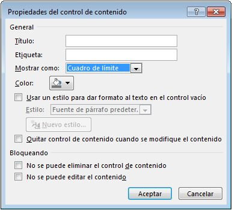
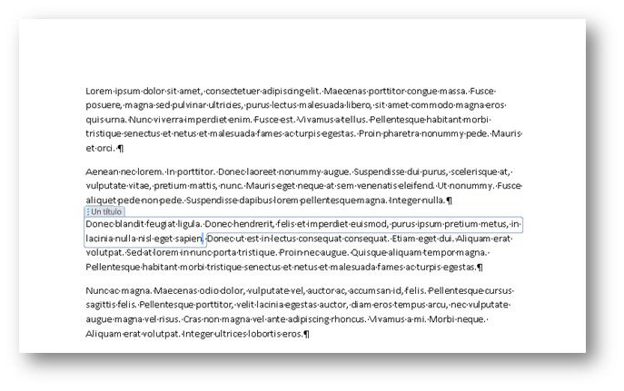
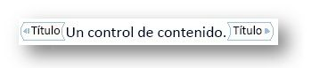
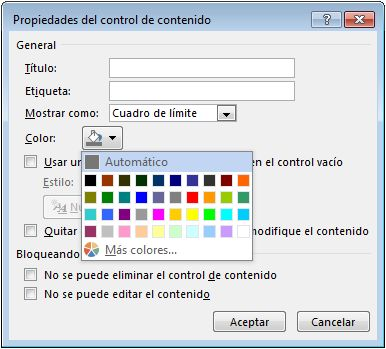
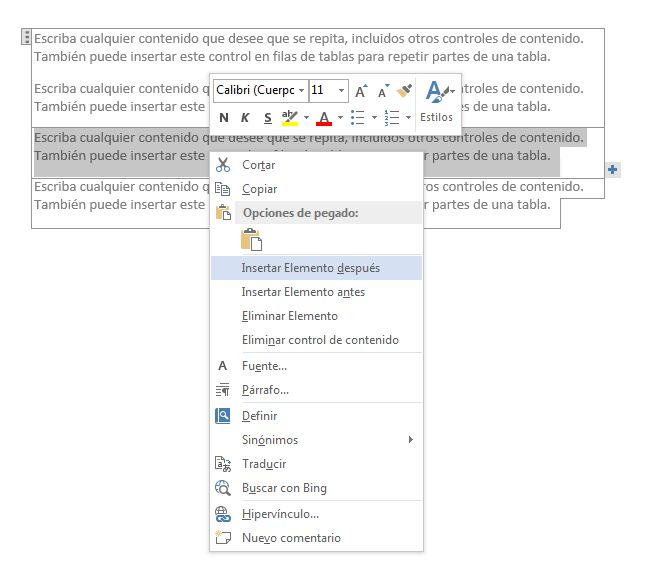
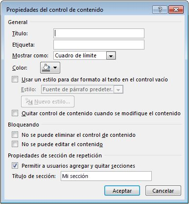
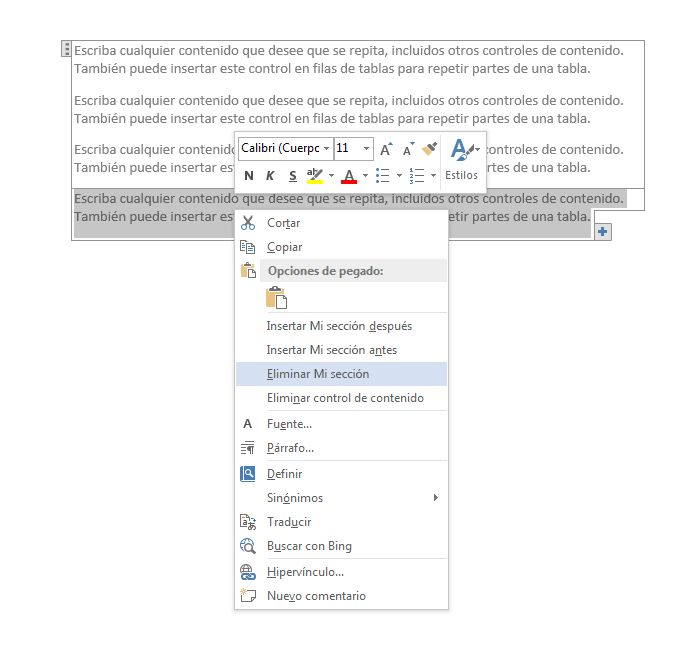
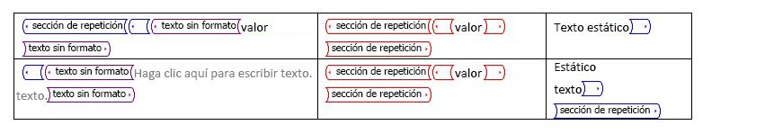

# <a name="content-controls-in-word"></a><span data-ttu-id="679f4-104">Controles de contenido en Word</span><span class="sxs-lookup"><span data-stu-id="679f4-104">Content controls in Word</span></span>

<span data-ttu-id="679f4-105">Obtenga información sobre cómo los controles de contenido de Microsoft Word 2013 habilitan una mayor variedad de escenarios de documentos estructurados.</span><span class="sxs-lookup"><span data-stu-id="679f4-105">Learn how Microsoft Word 2013 content controls enable a larger range of structured document scenarios.</span></span>

<span data-ttu-id="679f4-106">En este tema se proporciona información acerca de los cambios realizados en los controles de contenido en Microsoft Word 2013 y los escenarios de documentos que permiten a esos cambios.</span><span class="sxs-lookup"><span data-stu-id="679f4-106">This topic provides information about changes to content controls in Microsoft Word 2013 and the document scenarios that those changes enable.</span></span>
  
### <a name="structured-documents"></a><span data-ttu-id="679f4-107">Documentos estructurados</span><span class="sxs-lookup"><span data-stu-id="679f4-107">Structured documents</span></span>
<span data-ttu-id="679f4-108"><a name="WordCC_StructuredDocs"> </a></span><span class="sxs-lookup"><span data-stu-id="679f4-108"></span></span>

<span data-ttu-id="679f4-109">Los documentos estructurados son documentos que controlan donde puede aparecer el contenido en un documento, el tipo de contenido que puede aparecer en el documento y si dicho contenido se puede editar.</span><span class="sxs-lookup"><span data-stu-id="679f4-109">Structured documents are documents that control where content can appear on a document, what kind of content can appear in the document, and whether that content can be edited.</span></span>
  
<span data-ttu-id="679f4-110">A continuación presentamos algunos escenarios comunes para contenido estructurado en Microsoft Word:</span><span class="sxs-lookup"><span data-stu-id="679f4-110">Here are some common scenarios for structured content in Microsoft Word:</span></span>
  
- <span data-ttu-id="679f4-111">Una asesoría jurídica necesita crear documentos que contienen lenguaje legal que no debería ser modificado por el usuario.</span><span class="sxs-lookup"><span data-stu-id="679f4-111">A legal firm needs to create documents that contain legal language that should not be changed by the user.</span></span>
    
- <span data-ttu-id="679f4-112">Una empresa necesita crear una portada de propuesta en la que el usuario solo escribe el título, el autor y la fecha.</span><span class="sxs-lookup"><span data-stu-id="679f4-112">A business needs to create a proposal cover page where only the title, author, and date are entered by the user.</span></span>
    
- <span data-ttu-id="679f4-113">Una empresa necesita crear facturas en las que los datos del cliente aparezcan en la factura en zonas predefinidas.</span><span class="sxs-lookup"><span data-stu-id="679f4-113">A business needs to create invoices where the customer data is included in the invoice at predefined regions.</span></span>
    
### <a name="using-content-controls-to-structure-a-document"></a><span data-ttu-id="679f4-114">Uso de controles de contenido para estructurar un documento</span><span class="sxs-lookup"><span data-stu-id="679f4-114">Using content controls to structure a document</span></span>
<span data-ttu-id="679f4-115"><a name="WordCC_StructuredDocs"> </a></span><span class="sxs-lookup"><span data-stu-id="679f4-115"></span></span>

<span data-ttu-id="679f4-116">Controles de contenido son entidades de Microsoft Word que actúan como contenedores de contenido específico en un documento.</span><span class="sxs-lookup"><span data-stu-id="679f4-116">Content controls are Microsoft Word entities that act as containers for specific content in a document.</span></span> <span data-ttu-id="679f4-117">Los controles de contenido individuales pueden incluir elementos como fechas, listas o párrafos de texto con formato.</span><span class="sxs-lookup"><span data-stu-id="679f4-117">Individual content controls can contain content such as dates, lists, or paragraphs of formatted text.</span></span> <span data-ttu-id="679f4-118">Controles de contenido de ayuda crear enriquecido, bloques de contenido estructurados y están diseñados para su uso en las plantillas que insertan bloques perfectamente definidos en los documentos, creación de documentos estructurados.</span><span class="sxs-lookup"><span data-stu-id="679f4-118">Content controls help you to create rich, structured blocks of content and are designed for use in templates that insert well-defined blocks into your documents, creating structured documents.</span></span>
  
<span data-ttu-id="679f4-119">Los controles de contenido son ideales para crear documentos estructurados porque los controles de contenido le ayudan a fijar la posición de contenido, especificar el tipo de contenido (por ejemplo, una fecha, una imagen o texto), restringir o habilitar la edición, y agregar significado semántico al contenido.</span><span class="sxs-lookup"><span data-stu-id="679f4-119">Content controls are ideal for creating structured documents because content controls help you fix the position of content, specify the kind of content (for example, a date, a picture, or text), restrict or enable editing, and add semantic meaning to content.</span></span>
  
### <a name="content-controls-in-word-2010"></a><span data-ttu-id="679f4-120">Controles de contenido en Word 2010</span><span class="sxs-lookup"><span data-stu-id="679f4-120">Content controls in Word 2010</span></span>
<span data-ttu-id="679f4-121"><a name="WordCC_StructuredDocs"> </a></span><span class="sxs-lookup"><span data-stu-id="679f4-121"></span></span>

<span data-ttu-id="679f4-122">Los siguientes controles de contenido están disponibles en Word 2010:</span><span class="sxs-lookup"><span data-stu-id="679f4-122">The following content controls are available in Word 2010:</span></span>
  
- <span data-ttu-id="679f4-123">Texto enriquecido</span><span class="sxs-lookup"><span data-stu-id="679f4-123">Rich Text</span></span>
    
- <span data-ttu-id="679f4-124">Texto sin formato</span><span class="sxs-lookup"><span data-stu-id="679f4-124">Plain Text</span></span>
    
- <span data-ttu-id="679f4-125">Imagen</span><span class="sxs-lookup"><span data-stu-id="679f4-125">Picture</span></span>
    
- <span data-ttu-id="679f4-126">Galería de bloques de creación</span><span class="sxs-lookup"><span data-stu-id="679f4-126">Building Block Gallery</span></span>
    
- <span data-ttu-id="679f4-127">Cuadro combinado</span><span class="sxs-lookup"><span data-stu-id="679f4-127">Combo Box</span></span>
    
- <span data-ttu-id="679f4-128">Lista desplegable</span><span class="sxs-lookup"><span data-stu-id="679f4-128">Drop-Down List</span></span>
    
- <span data-ttu-id="679f4-129">Fecha</span><span class="sxs-lookup"><span data-stu-id="679f4-129">Date</span></span>
    
- <span data-ttu-id="679f4-130">Casilla de verificación</span><span class="sxs-lookup"><span data-stu-id="679f4-130">Checkbox</span></span>
    
- <span data-ttu-id="679f4-131">Grupo</span><span class="sxs-lookup"><span data-stu-id="679f4-131">Group</span></span>
    
<span data-ttu-id="679f4-132">Controles de contenido de Word 2010 habilitar diversas soluciones de documentos estructurados posibles, pero en Word 2013 controles de contenido permiten una mayor variedad de escenarios.</span><span class="sxs-lookup"><span data-stu-id="679f4-132">Word 2010 content controls enable various potential structured document solutions, but in Word 2013 content controls enable a greater range of scenarios.</span></span>
  
## <a name="content-control-improvements-in-word-2013"></a><span data-ttu-id="679f4-133">Mejoras de control de contenido en Word 2013</span><span class="sxs-lookup"><span data-stu-id="679f4-133">Content control improvements in Word 2013</span></span>
<span data-ttu-id="679f4-134"><a name="WordCC_WhatsNew"> </a></span><span class="sxs-lookup"><span data-stu-id="679f4-134"></span></span>

<span data-ttu-id="679f4-135">En Word 2013, los controles de contenido proporcionan tres mejoras claves: mejorado de la visualización, soporte técnico para la asignación de XML para los controles de contenido de texto Rich y un nuevo control de contenido para contenido repetido.</span><span class="sxs-lookup"><span data-stu-id="679f4-135">In Word 2013, content controls provide three key improvements: improved visualization, support for XML Mapping for Rich Text content controls, and a new content control for repeating content.</span></span>
  
### <a name="improved-visualization"></a><span data-ttu-id="679f4-136">Visualización mejorada</span><span class="sxs-lookup"><span data-stu-id="679f4-136">Improved visualization</span></span>

<span data-ttu-id="679f4-137">Word 2013 permite que un control de contenido individual que aparezca en uno de tres estados posibles:</span><span class="sxs-lookup"><span data-stu-id="679f4-137">Word 2013 allows an individual content control to appear in one of three possible states:</span></span>
  
- <span data-ttu-id="679f4-138">Rectángulo de selección</span><span class="sxs-lookup"><span data-stu-id="679f4-138">Bounding box</span></span>
    
- <span data-ttu-id="679f4-139">Etiquetas de inicio o finalización</span><span class="sxs-lookup"><span data-stu-id="679f4-139">Start/End tags</span></span>
    
- <span data-ttu-id="679f4-140">Ninguno</span><span class="sxs-lookup"><span data-stu-id="679f4-140">None</span></span>
    
> [!NOTE]
> <span data-ttu-id="679f4-141">Si no se indique lo contrario, en esta sección se describe la visualización de los controles de contenido cuando el documento no se ve en **Modo de diseño**. Establecer el modo de presentación para un control de contenido mediante el control de lista desplegable **se muestran como** en el cuadro de diálogo **Propiedades del Control de contenido** .</span><span class="sxs-lookup"><span data-stu-id="679f4-141">If not stated otherwise, this section discusses the visualization of content controls when the document is not viewed in **Design Mode**.You set the display mode for a content control by using the **Show as** drop-down list control in the **Content Control Properties** dialog box.</span></span> 
  
<span data-ttu-id="679f4-142">**En la figura 1. Cuadro de diálogo de propiedades de Control de contenido**</span><span class="sxs-lookup"><span data-stu-id="679f4-142">**Figure 1. Content Control Properties dialog box**</span></span>

<span data-ttu-id="679f4-143">![Cuadro de diálogo de propiedades de control de contenido] (media/DK2_WordCC_Fig01.jpg "Cuadro de diálogo de propiedades de control de contenido")</span><span class="sxs-lookup"><span data-stu-id="679f4-143"></span></span>
  
<span data-ttu-id="679f4-144">También puede establecer el modo de presentación para un control de contenido mediante el modelo de objetos de Word 2013 (Esto se describe más adelante en [miembros del modelo de objeto de control de contenido de nuevo Word 2013](#WordCC_NewOM)).</span><span class="sxs-lookup"><span data-stu-id="679f4-144">You can also set the display mode for a content control by using the Word 2013 object model (discussed later in [New Word 2013 content control object model members](#WordCC_NewOM)).</span></span>
  
### <a name="bounding-box"></a><span data-ttu-id="679f4-145">Rectángulo de selección</span><span class="sxs-lookup"><span data-stu-id="679f4-145">Bounding box</span></span>
<span data-ttu-id="679f4-146"><a name="WordCC_DefaultRendering"> </a></span><span class="sxs-lookup"><span data-stu-id="679f4-146"></span></span>

<span data-ttu-id="679f4-147">La representación predeterminada para los controles de contenido en Word 2013 es conservar el aspecto de los controles de contenido, tal como aparecen en Word 2007 y Word 2010; es decir, como un cuadro de límite.</span><span class="sxs-lookup"><span data-stu-id="679f4-147">The default rendering for content controls in Word 2013 is to preserve the look of content controls as they appear in Word 2007 and Word 2010; that is, as a bounding box.</span></span> <span data-ttu-id="679f4-148">Cuando un control de contenido está configurado para mostrar como **Cuadro de límite**, la visualización cambia según la interacción del usuario siguientes:</span><span class="sxs-lookup"><span data-stu-id="679f4-148">When a content control is set to show as **Bounding Box**, the display changes depending upon the following user interaction:</span></span>
  
- <span data-ttu-id="679f4-149">Cuando el control de contenido no tiene el foco, no se produce ninguna visualización.</span><span class="sxs-lookup"><span data-stu-id="679f4-149">When the content control does not have the focus, no visualization occurs</span></span>
    
- <span data-ttu-id="679f4-150">Al pasar el mouse sobre él, el control de contenido aparece como un rectángulo sombreado.</span><span class="sxs-lookup"><span data-stu-id="679f4-150">On mouse-over, the content control appears as a shaded rectangle</span></span>
    
<span data-ttu-id="679f4-151">**La figura 2. Control de contenido al pasar el mouse**</span><span class="sxs-lookup"><span data-stu-id="679f4-151">**Figure 2. Content control on mouse-over**</span></span>

<span data-ttu-id="679f4-152">![Control en el mouse (ratón) de contenido a través de] (media/DK2_WordCC_Fig02.jpg "Control en el mouse (ratón) de contenido a través de")</span><span class="sxs-lookup"><span data-stu-id="679f4-152"></span></span>
  
- <span data-ttu-id="679f4-153">Cuando el control de contenido tiene el foco (cuando el usuario elige el control de contenido), el control aparece como un "rectángulo de selección" (con una línea alrededor del contenido y la exhibición de título, si se ha definido un título).</span><span class="sxs-lookup"><span data-stu-id="679f4-153">When the content control has the focus (when the user chooses the content control), the control appears as a "bounding box" (with a line around the content and the title showing, if a title has been set)</span></span>
    
<span data-ttu-id="679f4-154">**La figura 3. Control de contenido con foco**</span><span class="sxs-lookup"><span data-stu-id="679f4-154">**Figure 3. Content control with focus**</span></span>

<span data-ttu-id="679f4-155">![Control con el foco de contenido] (media/DK2_WordCC_Fig03.jpg "Control con el foco de contenido")</span><span class="sxs-lookup"><span data-stu-id="679f4-155"></span></span>
  
### <a name="startend-tags"></a><span data-ttu-id="679f4-156">Etiquetas de inicio o finalización</span><span class="sxs-lookup"><span data-stu-id="679f4-156">Start/End tags</span></span>
<span data-ttu-id="679f4-157"><a name="WordCC_StartEndTags"> </a></span><span class="sxs-lookup"><span data-stu-id="679f4-157"></span></span>

<span data-ttu-id="679f4-158">Cuando el control de contenido está configurado para mostrar como **etiqueta de inicio y finalización**, se muestran las etiquetas independientemente de la interacción del usuario, y el título no aparecerá nunca; pero los botones, como el botón de **Lista desplegable** , aparecen en el mouse (ratón) a través de.</span><span class="sxs-lookup"><span data-stu-id="679f4-158">When the content control is set to show as **Start/End tag**, the tags are displayed regardless of user interaction, and the title never appears; but buttons, such as the **Drop-Down List** button, appear on mouse over.</span></span> 
  
<span data-ttu-id="679f4-159">**La figura 4. Control de contenido configurado para mostrar como etiquetas de inicio y finalización**</span><span class="sxs-lookup"><span data-stu-id="679f4-159">**Figure 4. Content control set to show as start/end tags**</span></span>

<span data-ttu-id="679f4-160">![Control de contenido configurado para mostrar como de inicio y finalización de las etiquetas] (media/DK2_WordCC_Fig04.jpg "Control de contenido configurado para mostrar como de inicio y finalización de las etiquetas")</span><span class="sxs-lookup"><span data-stu-id="679f4-160"></span></span>
  
### <a name="none"></a><span data-ttu-id="679f4-161">None</span><span class="sxs-lookup"><span data-stu-id="679f4-161">None</span></span>
<span data-ttu-id="679f4-162"><a name="WordCC_Invisible"> </a></span><span class="sxs-lookup"><span data-stu-id="679f4-162"></span></span>

<span data-ttu-id="679f4-163">Cuando el control de contenido está configurado para mostrar como **Ninguno**, no se muestra el control de contenido.</span><span class="sxs-lookup"><span data-stu-id="679f4-163">When the content control is set to show as **None**, the content control is not displayed.</span></span>
  
### <a name="content-control-colorization"></a><span data-ttu-id="679f4-164">Coloración del control de contenido</span><span class="sxs-lookup"><span data-stu-id="679f4-164">Content control colorization</span></span>
<span data-ttu-id="679f4-165"><a name="WordCC_CCColorization"> </a></span><span class="sxs-lookup"><span data-stu-id="679f4-165"></span></span>

<span data-ttu-id="679f4-166">Además de habilitar a un tipo de presentación para un control de contenido diferente, Word 2013 también le ayuda a establecer el color de un control de contenido individual.</span><span class="sxs-lookup"><span data-stu-id="679f4-166">In addition to enabling a different kind of display for a content control, Word 2013 also helps you to set the color for an individual content control.</span></span> <span data-ttu-id="679f4-167">Establecer el color de un control de contenido mediante el botón de **Color** en el cuadro de diálogo **Propiedades del Control de contenido** .</span><span class="sxs-lookup"><span data-stu-id="679f4-167">You set the color of a content control by using the **Color** button in the **Content Control Properties** dialog box.</span></span> 
  
<span data-ttu-id="679f4-168">También puede establecer el color de un control de contenido mediante el modelo de objetos de Word 2013 (Esto se describe más adelante en [miembros del modelo de objeto de control de contenido de nuevo Word 2013](#WordCC_NewOM)).</span><span class="sxs-lookup"><span data-stu-id="679f4-168">You can also set the color of a content control by using the Word 2013 object model (discussed later in [New Word 2013 content control object model members](#WordCC_NewOM)).</span></span>
  
<span data-ttu-id="679f4-169">**La figura 5. Cuadro de diálogo de propiedades de Control de contenido**</span><span class="sxs-lookup"><span data-stu-id="679f4-169">**Figure 5. Content Control Properties dialog box**</span></span>

<span data-ttu-id="679f4-170">![Cuadro de diálogo de propiedades de control de contenido] (media/DK2_WordCC_Fig05.jpg "Cuadro de diálogo de propiedades de control de contenido")</span><span class="sxs-lookup"><span data-stu-id="679f4-170"></span></span>
  
### <a name="support-for-xml-mapping-for-rich-text-content-controls"></a><span data-ttu-id="679f4-171">Compatibilidad con la asignación XML para controles de contenido de texto enriquecido</span><span class="sxs-lookup"><span data-stu-id="679f4-171">Support for XML mapping for rich text content controls</span></span>
<span data-ttu-id="679f4-172"><a name="WordCC_XMLMapping"> </a></span><span class="sxs-lookup"><span data-stu-id="679f4-172"></span></span>

<span data-ttu-id="679f4-173">Word 2013 le ayuda a asignar el contenido de los controles de contenido de texto enriquecido y controles de contenido de bloque de creación de documentos en el almacén de datos XML.</span><span class="sxs-lookup"><span data-stu-id="679f4-173">Word 2013 helps you to map the content of rich text content controls and document building block content controls to the XML data store.</span></span> <span data-ttu-id="679f4-174">Para ello, se establece la *asignación XML* para el control de contenido.</span><span class="sxs-lookup"><span data-stu-id="679f4-174">To do this, you set the  *XML mapping*  for the content control.</span></span> <span data-ttu-id="679f4-175">Puede establecer esta propiedad mediante el método **XMLMapping.SetMapping** existente en el modelo de objetos.</span><span class="sxs-lookup"><span data-stu-id="679f4-175">You can set this property by using the existing **XMLMapping.SetMapping** method in the object model.</span></span> <span data-ttu-id="679f4-176">En el fragmento XML personalizado, el código XML personalizado se almacena como marcado de Open XML plano convertido en una cadena (mediante el uso de codificación XML estándar), por lo que se puede almacenar como un nodo de texto en el fragmento XML personalizado.</span><span class="sxs-lookup"><span data-stu-id="679f4-176">Within the custom XML part, the custom XML is stored as flat Open XML markup converted into a string (by using standard XML encoding), so that it can be stored as a text node in the custom XML part.</span></span> <span data-ttu-id="679f4-177">Sin embargo, la asignación sigue teniendo la limitación que puede asignar solo correctamente para atributos o nodos de hoja.</span><span class="sxs-lookup"><span data-stu-id="679f4-177">However, the mapping continues to have the limitation that it can only successfully map to leaf nodes or attributes.</span></span> 
  
> [!NOTE]
> <span data-ttu-id="679f4-p105">Los controles de contenido de texto enriquecido no pueden contener otros controles de contenido de texto enriquecido. Si uno existe dentro de otro (por ejemplo, debido a una manipulación del formato de archivo, mediante copiar y pegar, etc.), se desvincula hasta que deja de estar contenido dentro de un control de texto enriquecido.</span><span class="sxs-lookup"><span data-stu-id="679f4-p105">Rich text content controls cannot contain other rich text content controls. If one exists inside of another (for example, because of file format manipulation, copy and paste, and so on), it is unlinked until it is no longer contained inside a mapped rich text control.</span></span> 
  
<span data-ttu-id="679f4-180">Para obtener más información acerca de cómo configurar la asignación de XML, vea la sección [miembros del modelo de objeto de control de contenido de nuevo Word 2013](#WordCC_NewOM) más adelante en este tema.</span><span class="sxs-lookup"><span data-stu-id="679f4-180">For more information about how to set up XML mapping, see the section [New Word 2013 content control object model members](#WordCC_NewOM) later in this topic.</span></span> 
  
### <a name="supporting-repeating-content"></a><span data-ttu-id="679f4-181">Compatibilidad con contenido de repetición</span><span class="sxs-lookup"><span data-stu-id="679f4-181">Supporting repeating content</span></span>
<span data-ttu-id="679f4-182"><a name="WordCC_SupportingRepeating"> </a></span><span class="sxs-lookup"><span data-stu-id="679f4-182"></span></span>

<span data-ttu-id="679f4-183">Además de las mejoras de visualización y soporte técnico para la asignación de XML a los controles de contenido de texto enriquecido, Word 2013 también agrega un nuevo control de contenido que permite a repetir el contenido.</span><span class="sxs-lookup"><span data-stu-id="679f4-183">In addition to visualization enhancements and support for XML mapping to rich text content controls, Word 2013 also adds a new content control that enables you to repeat content.</span></span> <span data-ttu-id="679f4-184">El control de contenido de sección de repetición repite el contenido dentro del mismo, incluidos otros controles de contenido.</span><span class="sxs-lookup"><span data-stu-id="679f4-184">The repeating section content control repeats the content contained within it, including other content controls.</span></span>
  
<span data-ttu-id="679f4-p107">El control de contenido para repetición de secciones se inserta alrededor de párrafos enteros o de filas de tablas. Una vez que el control rodea una sección, puede insertar copias de la sección encima o debajo de la sección contenida.</span><span class="sxs-lookup"><span data-stu-id="679f4-p107">You insert the repeating section content control around entire paragraphs or table rows. Once the control surrounds a section, you can insert copies of the section above or below the contained section.</span></span>
  
<span data-ttu-id="679f4-187">**La figura 6. Menú contextual de control de contenido de sección de repetición**</span><span class="sxs-lookup"><span data-stu-id="679f4-187">**Figure 6. Repeating section content control context menu**</span></span>

<span data-ttu-id="679f4-188">![Contexto de control de contenido de sección de repetición] (media/DK2_WordCC_Fig06.jpg "Contexto de control de contenido de sección de repetición")</span><span class="sxs-lookup"><span data-stu-id="679f4-188"></span></span>
  
<span data-ttu-id="679f4-189">Puede repetir la sección insertada mediante el control en el extremo del control de contenido (que se muestra como un botón con un) de signo más) o eligiendo un comando en el menú contextual, como se muestra en la figura 6.</span><span class="sxs-lookup"><span data-stu-id="679f4-189">You can repeat the inserted section by using either the control on the end of the content control (displayed as a button with a plus sign ()) or by choosing a command on the context menu, as shown in Figure 6.</span></span> <span data-ttu-id="679f4-190">El contenido repetido se convierte en una sección independiente del control que puede asignar un título mediante el cuadro de diálogo **Propiedades del Control de contenido** .</span><span class="sxs-lookup"><span data-stu-id="679f4-190">The repeated content becomes a separate section of the control that you can assign a title by using the **Content Control Properties** dialog box.</span></span> 
  
<span data-ttu-id="679f4-191">**La figura 7. Asignar un título de sección en el cuadro de diálogo Propiedades del Control de contenido**</span><span class="sxs-lookup"><span data-stu-id="679f4-191">**Figure 7. Assign a section title in the Content Control Properties dialog box**</span></span>

<span data-ttu-id="679f4-192">![Cuadro de diálogo de propiedades de control de contenido] (media/DK2_WordCC_Fig07.jpg "Cuadro de diálogo de propiedades de control de contenido")</span><span class="sxs-lookup"><span data-stu-id="679f4-192"></span></span>
  
<span data-ttu-id="679f4-193">Una vez que se ha concedido a la sección un título, si selecciona **Permitir a los usuarios para agregar y quitar secciones** en el cuadro de diálogo **Propiedades del Control de contenido** , los usuarios pueden agregar o eliminar la sección por su nombre.</span><span class="sxs-lookup"><span data-stu-id="679f4-193">Once you have given the section a title, if you select **Allow users to add and remove sections** in the **Content Control Properties** dialog box, users can add or delete the section by name.</span></span> 
  
<span data-ttu-id="679f4-194">**La figura 8. Use el menú de contexto de control de contenido de sección extensible para eliminar una sección**</span><span class="sxs-lookup"><span data-stu-id="679f4-194">**Figure 8. Use the repeating section content control context menu to delete a section**</span></span>

<span data-ttu-id="679f4-195">![Contexto de control de contenido de sección de repetición] (media/DK2_WordCC_Fig08.jpg "Contexto de control de contenido de sección de repetición")</span><span class="sxs-lookup"><span data-stu-id="679f4-195"></span></span>
  
<span data-ttu-id="679f4-p109">Cuando un control de contenido para repetición de secciones rodea a otros controles de contenido, los controles de contenido rodeados se repiten en cada nuevo elemento; pero el contenido de dichos controles de contenido se restablece a texto de marcador de posición. Hay dos excepciones en las que se conserva el contenido del control secundario:</span><span class="sxs-lookup"><span data-stu-id="679f4-p109">When a repeating section content control surrounds other content controls, the enclosed content controls are repeated in each new item; but any such content controls have their contents reset to placeholder text. There are two exceptions where child control contents are preserved:</span></span> 
  
- <span data-ttu-id="679f4-198">Cuando un control secundario es un control para repetición de secciones.</span><span class="sxs-lookup"><span data-stu-id="679f4-198">When a child control is a repeating section control.</span></span>
    
- <span data-ttu-id="679f4-199">Cuando un control secundario se asigna mediante XML a un nodo fuera del control de contenido para repetición de secciones.</span><span class="sxs-lookup"><span data-stu-id="679f4-199">When a child control is XML-mapped to a node outside the repeating section content control.</span></span>
    
<span data-ttu-id="679f4-200">**En la figura 9. Control de contenido de la sección que contiene los controles secundarios antes de la repetición de repetición**</span><span class="sxs-lookup"><span data-stu-id="679f4-200">**Figure 9. Repeating section content control containing child controls before repeat**</span></span>

<span data-ttu-id="679f4-201">![Repita el control de contenido antes de repetición] (media/DK2_WordCC_Fig09.jpg "Repita el control de contenido antes de repetición")</span><span class="sxs-lookup"><span data-stu-id="679f4-201"></span></span>
  
<span data-ttu-id="679f4-202">**La figura 10. Control de contenido de la sección que contiene los controles secundarios después de la repetición de repetición**</span><span class="sxs-lookup"><span data-stu-id="679f4-202">**Figure 10. Repeating section content control containing child controls after repeat**</span></span>

<span data-ttu-id="679f4-203">![Repita el control de contenido de sección después de repetición] (media/DK2_WordCC_Fig10.jpg "Repita el control de contenido de sección después de repetición")</span><span class="sxs-lookup"><span data-stu-id="679f4-203"></span></span>
  
### <a name="repeating-section-content-controls-around-xml-mapped-controls"></a><span data-ttu-id="679f4-204">Controles de contenido de para repetición de secciones alrededor de los controles asignados XML</span><span class="sxs-lookup"><span data-stu-id="679f4-204">Repeating section content controls around XML-mapped controls</span></span>
<span data-ttu-id="679f4-205"><a name="WordCC_RepeatingSectionCCs"> </a></span><span class="sxs-lookup"><span data-stu-id="679f4-205"></span></span>

<span data-ttu-id="679f4-206">Para asignaciones XML que están contenidas en una sección de repetición, Word 2013 asignan como se indica a continuación.</span><span class="sxs-lookup"><span data-stu-id="679f4-206">For XML mappings that are contained in a repeating section, Word 2013 maps them as follows.</span></span>
  
<span data-ttu-id="679f4-207">Si la asignación no se cruzan con un elemento en el nodo establecido como parte de su cadena de principales, el enlace es un "enlace absoluto" y muestra el mismo contenido en todos los elementos de sección de repetición.</span><span class="sxs-lookup"><span data-stu-id="679f4-207">If the mapping does not intersect with an item in the node set as part of its parent chain, the binding is an "absolute binding" and shows the same content in all repeating section items.</span></span>
  
<span data-ttu-id="679f4-208">Si la asignación forma una intersección con un elemento en el nodo establecido como parte de su cadena de principales, el enlace es un "enlace relativo" y se reasignan como sigue:</span><span class="sxs-lookup"><span data-stu-id="679f4-208">If the mapping does intersect with an item in the node set as part of its parent chain, the binding is a "relative binding", and is remapped as follows:</span></span>
  
- <span data-ttu-id="679f4-209">Se determina el enlace absoluto del nodo (reduciendo cualquier expresión de consulta), esto debería suceder en la asignación inicial.</span><span class="sxs-lookup"><span data-stu-id="679f4-209">The absolute binding for the node is determined (flattening out any query expressions)─this should happen on initial mapping</span></span>
    
- <span data-ttu-id="679f4-210">Se quita el eje del enlace que interseca con el grupo de nodos.</span><span class="sxs-lookup"><span data-stu-id="679f4-210">The axis of the binding that intersects with the node set is removed</span></span>
    
- <span data-ttu-id="679f4-211">El resto de la XPath se evalúa en relación con la XPath del elemento de contenido de la sección de repetición.</span><span class="sxs-lookup"><span data-stu-id="679f4-211">The remainder of the XPath is evaluated relative to the XPath of the repeating section content item</span></span>
    
<span data-ttu-id="679f4-212">Por ejemplo, podrían producirse las siguientes asignaciones:</span><span class="sxs-lookup"><span data-stu-id="679f4-212">For example, the following mappings might occur:</span></span>
  
- <span data-ttu-id="679f4-213">La sección de repetición se asigna a \root\next\path.</span><span class="sxs-lookup"><span data-stu-id="679f4-213">The repeating section is mapped to \root\next\path</span></span>
    
- <span data-ttu-id="679f4-214">El control en el elemento de ejemplo se asigna a \root\next\path[2]\baz.</span><span class="sxs-lookup"><span data-stu-id="679f4-214">The control in the sample item is mapped to \root\next\path[2]\baz</span></span>
    
- <span data-ttu-id="679f4-215">Word hace coincidir \root\next\path[2] con un elemento del grupo de nodos.</span><span class="sxs-lookup"><span data-stu-id="679f4-215">Word matches \root\next\path[2] to an item in the node set</span></span>
    
<span data-ttu-id="679f4-216">Por lo tanto, el enlace se evalúa como .\baz, donde la base es el nodo del elemento de contenido de repetición.</span><span class="sxs-lookup"><span data-stu-id="679f4-216">The binding is therefore evaluated as .\baz, where the base is the node of the repeating content item.</span></span>
  
<span data-ttu-id="679f4-217">Las siguientes sugerencias para trabajar con controles para repetición de contenido pueden ayudar a evitar la pérdida de datos y evitar frustraciones.</span><span class="sxs-lookup"><span data-stu-id="679f4-217">The following suggestions for working with repeating content controls can help you prevent data loss and avoid frustration.</span></span>
  
### <a name="working-with-repeating-section-content-controls-that-are-mapped-to-xml-data"></a><span data-ttu-id="679f4-218">Trabajo con controles de contenido para repetición de secciones que están asignados a datos XML</span><span class="sxs-lookup"><span data-stu-id="679f4-218">Working with repeating section content controls that are mapped to XML data</span></span>
<span data-ttu-id="679f4-219"><a name="WordCC_RepeatingSectionCCs"> </a></span><span class="sxs-lookup"><span data-stu-id="679f4-219"></span></span>

<span data-ttu-id="679f4-220">Si inserta un control de contenido de sección extensible que se asigna a los datos XML, cada vez que el usuario vuelve a abrir el documento, Word vuelve a crear los elementos de sección de repetición, basándose en la información en el almacén de datos.</span><span class="sxs-lookup"><span data-stu-id="679f4-220">If you insert a repeating section content control that is mapped to XML data, every time your user reopens the document, Word recreates the repeating section items, based on the information in the data store.</span></span> <span data-ttu-id="679f4-221">Incluso si se guarda el documento, se pierden todos los cambios que realiza el usuario en los elementos de sección extensible en el documento que no se asignan también en el almacén de datos.</span><span class="sxs-lookup"><span data-stu-id="679f4-221">Even if you save the document, any changes that the user makes in the repeating section items in the document that aren't also mapped into the data store are lost.</span></span>
  
<span data-ttu-id="679f4-222">Para impedir que esto ocurra, bloquee el control de contenido para repetición de secciones y permita que el usuario solo pueda modificar los controles de contenido secundarios desbloqueados que también estén asignados al XML.</span><span class="sxs-lookup"><span data-stu-id="679f4-222">To help prevent this from happening, lock the repeating section content control and allow the user to edit only in unlocked child content controls that are mapped to the XML as well.</span></span>
  
### <a name="binding-a-repeating-section-content-control-to-a-table"></a><span data-ttu-id="679f4-223">Enlace de un control de contenido para repetición de secciones a una tabla</span><span class="sxs-lookup"><span data-stu-id="679f4-223">Binding a repeating section content control to a table</span></span>
<span data-ttu-id="679f4-224"><a name="WordCC_RepeatingSectionCCs"> </a></span><span class="sxs-lookup"><span data-stu-id="679f4-224"></span></span>

<span data-ttu-id="679f4-225">Si desea enlazar un control de contenido de sección extensibles a una tabla, insertar en la tabla y *, a continuación,* el control de contenido insertar repetición sección y no al revés.</span><span class="sxs-lookup"><span data-stu-id="679f4-225">If you want to bind a repeating section content control to a table, insert the table and  *then*  the insert repeating section content control, and not the other way around.</span></span> <span data-ttu-id="679f4-226">(De lo contrario, no podrá seleccionar sólo la tabla).</span><span class="sxs-lookup"><span data-stu-id="679f4-226">(Otherwise, you won't be able to select only the table).</span></span> 
  
### <a name="nesting-repeating-section-content-controls-within-a-table"></a><span data-ttu-id="679f4-227">Anidamiento de controles de contenido para repetición de secciones dentro de una tabla</span><span class="sxs-lookup"><span data-stu-id="679f4-227">Nesting repeating section content controls within a table</span></span>
<span data-ttu-id="679f4-228"><a name="WordCC_RepeatingSectionCCs"> </a></span><span class="sxs-lookup"><span data-stu-id="679f4-228"></span></span>

<span data-ttu-id="679f4-229">El anidamiento ajustado de controles de contenido para repetición de secciones dentro de una tabla (por ejemplo, cuando el final del control de contenido para repetición de secciones principal y el secundario se encuentran en la misma celda) provoca que la sección de repetición externa se elimine cuando se agregue o se quite algún elemento de la sección interna.</span><span class="sxs-lookup"><span data-stu-id="679f4-229">Nesting repeating section content controls tightly within a table (for example, when the end of the parent and child repeating section content control is in the same cell) causes the outer repeating section to be deleted when the inner section has an item added or removed.</span></span>
  
<span data-ttu-id="679f4-230">Puede evitar que esto ocurra mediante la adición de un marcador de párrafo entre el final de un control de contenido de sección extensible y el siguiente.</span><span class="sxs-lookup"><span data-stu-id="679f4-230">You can prevent this from happening by adding a paragraph marker between the end of one repeating section content control and the next.</span></span> <span data-ttu-id="679f4-231">Para ocultar el marcador de párrafo, anule la selección de la opción **Mostrar u ocultar** de la ficha **Inicio** de la cinta de opciones.</span><span class="sxs-lookup"><span data-stu-id="679f4-231">To hide the paragraph marker, deselect the **Show/Hide** option on the **Home** tab of the ribbon.</span></span> 
  
### <a name="open-xml-file-format-schema-additions"></a><span data-ttu-id="679f4-232">Adiciones al esquema de formato de archivo Open XML</span><span class="sxs-lookup"><span data-stu-id="679f4-232">Open XML File Format schema additions</span></span>
<span data-ttu-id="679f4-233"><a name="WordCC"> </a></span><span class="sxs-lookup"><span data-stu-id="679f4-233"></span></span>

<span data-ttu-id="679f4-234">Se han agregado los siguientes elementos al esquema de formato de archivo Open XML de WordprocessingML.</span><span class="sxs-lookup"><span data-stu-id="679f4-234">The following elements were added to the WordprocessingML Open XML File Format schema.</span></span>
  
<span data-ttu-id="679f4-235">**La tabla 1. Nuevos elementos en el esquema de formato de archivo XML abierto de WordprocessingML para los controles de contenido**</span><span class="sxs-lookup"><span data-stu-id="679f4-235">**Table 1. New elements in the WordprocessingML Open XML File Format schema for content controls**</span></span>

|<span data-ttu-id="679f4-236">**Element**</span><span class="sxs-lookup"><span data-stu-id="679f4-236">**Element**</span></span>|<span data-ttu-id="679f4-237">**Descripción**</span><span class="sxs-lookup"><span data-stu-id="679f4-237">**Description**</span></span>|
|:-----|:-----|
|<span data-ttu-id="679f4-238">\<w:Appearance\></span><span class="sxs-lookup"><span data-stu-id="679f4-238">\<w:appearance\></span></span>  <br/> |<span data-ttu-id="679f4-239">\<w:Appearance\> es un elemento secundario de \<w:sdtPr\>.</span><span class="sxs-lookup"><span data-stu-id="679f4-239">\<w:appearance\> is a child element of \<w:sdtPr\>.</span></span>  <br/> <span data-ttu-id="679f4-240">Los valores siguientes son válidos para el atributo val:</span><span class="sxs-lookup"><span data-stu-id="679f4-240">The following values are valid for the val attribute:</span></span>  <br/> <span data-ttu-id="679f4-241">\<w:Appearance val = boundingBox</span><span class="sxs-lookup"><span data-stu-id="679f4-241">\<w:appearance val= boundingBox</span></span>|<span data-ttu-id="679f4-242">de cierre</span><span class="sxs-lookup"><span data-stu-id="679f4-242">tags</span></span>|<span data-ttu-id="679f4-243">oculto.</span><span class="sxs-lookup"><span data-stu-id="679f4-243">hidden.</span></span>  <br/> <span data-ttu-id="679f4-244">El valor predeterminado es boundingBox.</span><span class="sxs-lookup"><span data-stu-id="679f4-244">The default value is boundingBox.</span></span>  <br/> |
|<span data-ttu-id="679f4-245">\<w:color\></span><span class="sxs-lookup"><span data-stu-id="679f4-245">\<w:color\></span></span>  <br/> |<span data-ttu-id="679f4-246">\<w:color\> es un elemento secundario de \<w:sdtPr\>.</span><span class="sxs-lookup"><span data-stu-id="679f4-246">\<w:color\> is a child element of \<w:sdtPr\>.</span></span>  <br/> <span data-ttu-id="679f4-p113">El modelo de contenido coincide con el tipo complejo CT_Color existente. El valor predeterminado es el color utilizado en Word 2010.</span><span class="sxs-lookup"><span data-stu-id="679f4-p113">The content model matches the existing CT_Color complex type. The default value is the color used in Word 2010.</span></span>  <br/> |
   
## <a name="new-word-2013-content-control-object-model-members"></a><span data-ttu-id="679f4-249">Nuevos miembros de modelo de objeto de control de contenido de Word 2013</span><span class="sxs-lookup"><span data-stu-id="679f4-249">New Word 2013 content control object model members</span></span>
<span data-ttu-id="679f4-250"><a name="WordCC_NewOM"> </a></span><span class="sxs-lookup"><span data-stu-id="679f4-250"></span></span>

<span data-ttu-id="679f4-251">Con las nuevas mejoras y adiciones a controles de contenido en Word 2013, se actualizó el modelo de objetos de Word para permitir la manipulación mediante programación del nuevo conjunto de características.</span><span class="sxs-lookup"><span data-stu-id="679f4-251">With the new enhancements and additions to content controls in Word 2013, the object model for Word has been updated to allow for programmatic manipulation of the new feature set.</span></span> <span data-ttu-id="679f4-252">Además, también se efectuaron cambios en el formato de archivo XML abierto subyacente para documentos de procesamiento.</span><span class="sxs-lookup"><span data-stu-id="679f4-252">In addition, changes have also been made to the underlying Open XML File Format for word processing documents.</span></span>
  
<span data-ttu-id="679f4-253">Las secciones siguientes proporcionan más información acerca de los cambios específicos al modelo de objetos relacionados con cada mejora de los controles de contenido.</span><span class="sxs-lookup"><span data-stu-id="679f4-253">The following sections provide more information about the specific object model changes related to each content control enhancement.</span></span>
  
### <a name="visualization-enhancements"></a><span data-ttu-id="679f4-254">Mejoras de visualización</span><span class="sxs-lookup"><span data-stu-id="679f4-254">Visualization enhancements</span></span>
<span data-ttu-id="679f4-255"><a name="WordCC_VisEnhancements"> </a></span><span class="sxs-lookup"><span data-stu-id="679f4-255"></span></span>

<span data-ttu-id="679f4-256">Varias adiciones al modelo de objetos se incluyen en Word 2013 para mejoras de visualización de control de contenido.</span><span class="sxs-lookup"><span data-stu-id="679f4-256">Several object model additions are included in Word 2013 for content control visualization enhancements.</span></span> <span data-ttu-id="679f4-257">En la siguiente tabla se enumeran nuevos miembros del objeto **ContentControl** para la visualización.</span><span class="sxs-lookup"><span data-stu-id="679f4-257">The following table list new members of the **ContentControl** object for visualization.</span></span> 
  
<span data-ttu-id="679f4-258">**Tabla 2. Nuevos miembros de objeto ContentControl**</span><span class="sxs-lookup"><span data-stu-id="679f4-258">**Table 2. New ContentControl object members**</span></span>

|<span data-ttu-id="679f4-259">**Elemento**</span><span class="sxs-lookup"><span data-stu-id="679f4-259">**Member**</span></span>|<span data-ttu-id="679f4-260">**Descripción**</span><span class="sxs-lookup"><span data-stu-id="679f4-260">**Description**</span></span>|
|:-----|:-----|
|<span data-ttu-id="679f4-261">.</span><span class="sxs-lookup"><span data-stu-id="679f4-261"></span></span> <span data-ttu-id="679f4-262">**Apariencia** como **WdContentControlAppearance**</span><span class="sxs-lookup"><span data-stu-id="679f4-262">**Appearance** as **WdContentControlAppearance**</span></span> <br/> |<span data-ttu-id="679f4-263">Obtiene o establece la visualización del control de contenido.</span><span class="sxs-lookup"><span data-stu-id="679f4-263">Gets or sets the visualization of the content control.</span></span>  <br/> |
|<span data-ttu-id="679f4-264">.</span><span class="sxs-lookup"><span data-stu-id="679f4-264"></span></span> <span data-ttu-id="679f4-265">**Color** como **WdColor**</span><span class="sxs-lookup"><span data-stu-id="679f4-265">**Color** as **WdColor**</span></span> <br/> |<span data-ttu-id="679f4-266">Obtiene o establece el color del control de contenido.</span><span class="sxs-lookup"><span data-stu-id="679f4-266">Gets or sets the color of the content control.</span></span>  <br/> |
   
<span data-ttu-id="679f4-267">En la siguiente tabla se enumera las constantes en la enumeración **WdContentControlAppearance** nuevo.</span><span class="sxs-lookup"><span data-stu-id="679f4-267">The following table lists constants in the new **WdContentControlAppearance** enumeration.</span></span> 
  
<span data-ttu-id="679f4-268">**Tabla 3. Nuevas constantes de WdContentControlAppearance (enumeración)**</span><span class="sxs-lookup"><span data-stu-id="679f4-268">**Table 3. New WdContentControlAppearance enumeration constants**</span></span>

|<span data-ttu-id="679f4-269">**Constante**</span><span class="sxs-lookup"><span data-stu-id="679f4-269">**Constant**</span></span>|<span data-ttu-id="679f4-270">**Descripción**</span><span class="sxs-lookup"><span data-stu-id="679f4-270">**Description**</span></span>|
|:-----|:-----|
|<span data-ttu-id="679f4-271">**wdContentControlBoundingBox**</span><span class="sxs-lookup"><span data-stu-id="679f4-271">**wdContentControlBoundingBox**</span></span> <br/> |<span data-ttu-id="679f4-272">Representa un control de contenido que se muestra como un cuadro rectangular o un cuadro de selección sombreado (con título opcional).</span><span class="sxs-lookup"><span data-stu-id="679f4-272">Represents a content control shown as a shaded rectangle/bounding box (with optional title).</span></span>  <br/> |
|<span data-ttu-id="679f4-273">**wdContentControlTags**</span><span class="sxs-lookup"><span data-stu-id="679f4-273">**wdContentControlTags**</span></span> <br/> |<span data-ttu-id="679f4-274">Representa un control de contenido que se muestran como marcadores de inicio o finalización.</span><span class="sxs-lookup"><span data-stu-id="679f4-274">Represents a content control shown as start/end markers.</span></span>  <br/> |
|<span data-ttu-id="679f4-275">**wdContentControlHidden**</span><span class="sxs-lookup"><span data-stu-id="679f4-275">**wdContentControlHidden**</span></span> <br/> |<span data-ttu-id="679f4-276">Representa un control de contenido que no se muestra.</span><span class="sxs-lookup"><span data-stu-id="679f4-276">Represents a content control that is not shown.</span></span>  <br/> |
   
### <a name="code-sample"></a><span data-ttu-id="679f4-277">Ejemplo de código</span><span class="sxs-lookup"><span data-stu-id="679f4-277">Code sample</span></span>
<span data-ttu-id="679f4-278"><a name="WordCC_VisEnhancements"> </a></span><span class="sxs-lookup"><span data-stu-id="679f4-278"></span></span>

<span data-ttu-id="679f4-279">El siguiente ejemplo de código muestra cómo crear controles de contenido de texto enriquecido y establecer la visualización mediante programación.</span><span class="sxs-lookup"><span data-stu-id="679f4-279">The following code sample shows how to create rich text content controls and set visualization programmatically.</span></span>
  
```vb
Sub testVisualization()
   Dim objcc As ContentControl
   Dim objRange As Range
   
   ' Get the first paragraph as a range object.
   Set objRange = ActiveDocument.Paragraphs(1).Range
   ' Create a rich text content control around the first paragraph.
   Set objcc = ActiveDocument.ContentControls.Add(wdContentControlRichText, objRange)
   objcc.Title = "Default Bounding Box"
   ' Set visualization to the default.
   objcc.Appearance = wdContentControlBoundingBox
   
   ' Create a new paragraph.
   objRange.InsertParagraphAfter
   Set objRange = ActiveDocument.Paragraphs(2).Range
   ' Create a rich text content control around the second paragraph.
   Set objcc = ActiveDocument.ContentControls.Add(wdContentControlRichText, objRange)
   objcc.Title = "Non Bounding"
   ' Set visualization to invisible.
   objcc.Appearance = wdContentControlHidden
   
   ' Create a new paragraph.
   objRange.InsertParagraphAfter
   Set objRange = ActiveDocument.Paragraphs(3).Range
   ' Create a rich text content control around the third paragraph.
   Set objcc = ActiveDocument.ContentControls.Add(wdContentControlRichText, objRange)
   objcc.Title = "Tags Only with Pink color"
   ' Set visualization to Start/End tags with pink color.
   objcc.Appearance = wdContentControlTags
   objcc.Color = wdColorPink
End Sub
```

### <a name="xml-mapping"></a><span data-ttu-id="679f4-280">Asignación XML</span><span class="sxs-lookup"><span data-stu-id="679f4-280">XML mapping</span></span>
<span data-ttu-id="679f4-281"><a name="WordCC_XMLMappingOM"> </a></span><span class="sxs-lookup"><span data-stu-id="679f4-281"></span></span>

<span data-ttu-id="679f4-282">Se han realizado ningún adiciones al modelo de objetos de Word 2013 para dar cabida a la asignación de texto enriquecido a los nodos XML en el almacén de datos del documento.</span><span class="sxs-lookup"><span data-stu-id="679f4-282">No additions were made to the Word 2013 object model to accommodate rich text mapping to XML nodes in the document data store.</span></span> <span data-ttu-id="679f4-283">En su lugar, use el modelo de objetos existente para asignar un control de contenido de texto enriquecido a un nodo XML en el almacén de datos del documento.</span><span class="sxs-lookup"><span data-stu-id="679f4-283">Instead, use the existing object model to map a rich text content control to an XML node in the document data store.</span></span> <span data-ttu-id="679f4-284">Además, no se realizaron cambios en el esquema WordprocessingML de formato de archivo Open XML subyacente como parte de la compatibilidad de control de contenido de texto enriquecido recién incluido específicamente para una asignación XML.</span><span class="sxs-lookup"><span data-stu-id="679f4-284">Additionally, no changes were made to the underlying Open XML File Format WordprocessingML schema as part of the newly included rich text content control support specifically for XML mapping.</span></span>
  
#### <a name="code-sample"></a><span data-ttu-id="679f4-285">Ejemplo de código</span><span class="sxs-lookup"><span data-stu-id="679f4-285">Code sample</span></span>

<span data-ttu-id="679f4-286">El siguiente ejemplo de código muestra cómo asignar un control de contenido de texto enriquecido a un nodo XML mediante programación.</span><span class="sxs-lookup"><span data-stu-id="679f4-286">The following code sample shows how to map a rich text content control to an XML node programmatically.</span></span>
  
```vb
Sub testRichBinding()
   Dim objRange As Range
   Dim objcc As ContentControl
   Dim objCustomPart As CustomXMLPart
   Dim blnMap As Boolean
   
   ' Add a custom XML part to the data store.
   Set objCustomPart = ActiveDocument.CustomXMLParts.Add
   ' Load XML fragment into the custom XML part.
   objCustomPart.LoadXML ("<x>Rich Text Databinding</x>")
   ' Get the first paragraph as a range object.
   Set objRange = ActiveDocument.Paragraphs(1).Range
   ' Create a rich text content control around the first paragraph.
   Set objcc = ActiveDocument.ContentControls.Add(wdContentControlRichText, objRange)
   ' Bind the XML node to the rich text content control.
   blnMap = objcc.XMLMapping.SetMapping("/x")
   ' Return whether mapping worked.
   MsgBox objcc.XMLMapping.IsMapped
End Sub
```

### <a name="repeating-section-content-controls-represented-in-the-object-model"></a><span data-ttu-id="679f4-287">Controles de contenido para repetición de secciones representados en el modelo de objetos</span><span class="sxs-lookup"><span data-stu-id="679f4-287">Repeating section content controls represented in the object model</span></span>
<span data-ttu-id="679f4-288"><a name="WordCC_RepeatingSection"> </a></span><span class="sxs-lookup"><span data-stu-id="679f4-288"></span></span>

<span data-ttu-id="679f4-289">El control de contenido de sección de repetición está disponible en el modelo de objetos mediante el uso de las siguientes adiciones al objeto **ContentControl** y los nuevos objetos **RepeatingSectionItem** y **RepeatingSectionItemColl** .</span><span class="sxs-lookup"><span data-stu-id="679f4-289">The repeating section content control is available in the object model by using the following additions to the **ContentControl** object and the new **RepeatingSectionItem** and **RepeatingSectionItemColl** objects.</span></span> <span data-ttu-id="679f4-290">Tabla 4 se enumeran a los nuevos miembros más importantes del objeto **ContentControl** para controles de contenido de la sección de repetición.</span><span class="sxs-lookup"><span data-stu-id="679f4-290">Table 4 lists the most important new members of the **ContentControl** object for repeating section content controls.</span></span> 
  
<span data-ttu-id="679f4-291">**Tabla 4. Miembros del objeto ContentControl**</span><span class="sxs-lookup"><span data-stu-id="679f4-291">**Table 4. ContentControl object members**</span></span>

|<span data-ttu-id="679f4-292">**Elemento**</span><span class="sxs-lookup"><span data-stu-id="679f4-292">**Member**</span></span>|<span data-ttu-id="679f4-293">**Descripción**</span><span class="sxs-lookup"><span data-stu-id="679f4-293">**Description**</span></span>|
|:-----|:-----|
|<span data-ttu-id="679f4-294">**AllowInsertDeleteSection** como **Boolean**</span><span class="sxs-lookup"><span data-stu-id="679f4-294">**AllowInsertDeleteSection** as **Boolean**</span></span> <br/> |<span data-ttu-id="679f4-295">Obtiene o establece si los usuarios pueden agregar o quitar secciones desde el control de contenido mediante el uso de la interfaz de usuario.</span><span class="sxs-lookup"><span data-stu-id="679f4-295">Gets or sets whether users can add or remove sections from the content control by using the UI.</span></span> <span data-ttu-id="679f4-296">Si se llama a esta propiedad para un control de contenido que no es del tipo de sección de repetición, se produce un error en la llamada con el siguiente mensaje de error: "esta propiedad sólo se puede usar con controles de contenido de la sección de repetición."</span><span class="sxs-lookup"><span data-stu-id="679f4-296">If this property is called for a content control that is not of type repeating section, the call fails with the following error message: "This property can only be used with repeating section content controls."</span></span>  <br/> |
|<span data-ttu-id="679f4-297">**RepeatingSectionItemTitle** como **cadena.**</span><span class="sxs-lookup"><span data-stu-id="679f4-297">**RepeatingSectionItemTitle** as **String**</span></span> <br/> |<span data-ttu-id="679f4-298">Obtiene o establece el nombre de elementos usados en el menú contextual de la sección de repetición.</span><span class="sxs-lookup"><span data-stu-id="679f4-298">Gets or sets the name of repeating section items used in the context menu.</span></span> <span data-ttu-id="679f4-299">Si se llama a esta propiedad para un control de contenido que no es del tipo de sección de repetición, se produce un error en la llamada con: "esta propiedad sólo se puede usar con controles de contenido de la sección de repetición."</span><span class="sxs-lookup"><span data-stu-id="679f4-299">If this property is called for a content control that is not of type repeating section, the call fails with: "This property can only be used with repeating section content controls."</span></span>  <br/> |
|<span data-ttu-id="679f4-300">**InsertRepeatingSectionItemBefore** como **ContentControl**</span><span class="sxs-lookup"><span data-stu-id="679f4-300">**InsertRepeatingSectionItemBefore** as **ContentControl**</span></span> <br/> |<span data-ttu-id="679f4-301">Agrega un elemento de sección de repetición antes del elemento actual y devuelve el nuevo elemento de sección de repetición.</span><span class="sxs-lookup"><span data-stu-id="679f4-301">Adds a repeating section item before the current item and returns the new repeating section item.</span></span> <span data-ttu-id="679f4-302">Si se llama a este método para un control de contenido que no es del tipo de elemento de la sección de repetición, se produce un error en la llamada con: "esta propiedad sólo se puede usar con controles de contenido de elemento de sección de repetición."</span><span class="sxs-lookup"><span data-stu-id="679f4-302">If this method is called for a content control that is not of type repeating section item, the call fails with: "This property can only be used with repeating section item content controls."</span></span>  <br/> |
|<span data-ttu-id="679f4-303">**InsertRepeatingSectionItemAfter** como **ContentControl**</span><span class="sxs-lookup"><span data-stu-id="679f4-303">**InsertRepeatingSectionItemAfter** as **ContentControl**</span></span> <br/> |<span data-ttu-id="679f4-304">Agrega un elemento de sección de repetición después del elemento actual y devuelve el nuevo elemento de sección de repetición.</span><span class="sxs-lookup"><span data-stu-id="679f4-304">Adds a repeating section item after the current item and returns the new repeating section item.</span></span> <span data-ttu-id="679f4-305">Si se llama a este método para un control de contenido que no es del tipo de elemento de la sección de repetición, se produce un error en la llamada con: "esta propiedad sólo se puede usar con controles de contenido de elemento de sección de repetición."</span><span class="sxs-lookup"><span data-stu-id="679f4-305">If this method is called for a content control that is not of type repeating section item, the call fails with: "This property can only be used with repeating section item content controls."</span></span>  <br/> |
   
<span data-ttu-id="679f4-306">En la tabla 5 se enumeran a los miembros más importantes del objeto **RepeatingSectionItem** .</span><span class="sxs-lookup"><span data-stu-id="679f4-306">Table 5 lists the most important members of the **RepeatingSectionItem** object.</span></span> 
  
<span data-ttu-id="679f4-307">**Tabla 5. Miembros del objeto RepeatingSectionItem**</span><span class="sxs-lookup"><span data-stu-id="679f4-307">**Table 5. RepeatingSectionItem object members**</span></span>

|<span data-ttu-id="679f4-308">**Elemento**</span><span class="sxs-lookup"><span data-stu-id="679f4-308">**Member**</span></span>|<span data-ttu-id="679f4-309">**Descripción**</span><span class="sxs-lookup"><span data-stu-id="679f4-309">**Description**</span></span>|
|:-----|:-----|
|<span data-ttu-id="679f4-310">**Intervalo** como **intervalo**</span><span class="sxs-lookup"><span data-stu-id="679f4-310">**Range** as **Range**</span></span> <br/> |<span data-ttu-id="679f4-311">Devuelve el intervalo del elemento de sección extensible especificado, excluyendo las etiquetas de inicio y finalización.</span><span class="sxs-lookup"><span data-stu-id="679f4-311">Returns the range of the specified repeating section item, excluding the start and end tags.</span></span>  <br/> |
|<span data-ttu-id="679f4-312">**Delete**</span><span class="sxs-lookup"><span data-stu-id="679f4-312">**Delete**</span></span> <br/> |<span data-ttu-id="679f4-313">Elimina el elemento de sección de repetición especificado.</span><span class="sxs-lookup"><span data-stu-id="679f4-313">Deletes the specified repeating section item.</span></span>  <br/> |
|<span data-ttu-id="679f4-314">**InsertItemAfter** como **RepeatingSectionItem**</span><span class="sxs-lookup"><span data-stu-id="679f4-314">**InsertItemAfter** as **RepeatingSectionItem**</span></span> <br/> |<span data-ttu-id="679f4-315">Agrega un elemento de la sección de repetición después del elemento especificado y devuelve el elemento nuevo.</span><span class="sxs-lookup"><span data-stu-id="679f4-315">Adds a repeating section item after the specified item and returns the new item.</span></span>  <br/> |
|<span data-ttu-id="679f4-316">**InsertItemBefore** como **RepeatingSectionItem**</span><span class="sxs-lookup"><span data-stu-id="679f4-316">**InsertItemBefore** as **RepeatingSectionItem**</span></span> <br/> |<span data-ttu-id="679f4-317">Agrega un elemento de la sección de repetición antes del elemento especificado y devuelve el elemento nuevo.</span><span class="sxs-lookup"><span data-stu-id="679f4-317">Adds a repeating section item before the specified item and returns the new item.</span></span>  <br/> |
   
<span data-ttu-id="679f4-318">Tabla 6 se enumeran a los miembros más importantes del objeto **RepeatingSectionItemColl** .</span><span class="sxs-lookup"><span data-stu-id="679f4-318">Table 6 lists the most important members of the **RepeatingSectionItemColl** object.</span></span> 
  
<span data-ttu-id="679f4-319">**Tabla 6. Miembros del objeto RepeatingSectionItemColl**</span><span class="sxs-lookup"><span data-stu-id="679f4-319">**Table 6. RepeatingSectionItemColl object members**</span></span>

|<span data-ttu-id="679f4-320">**Elemento**</span><span class="sxs-lookup"><span data-stu-id="679f4-320">**Member**</span></span>|<span data-ttu-id="679f4-321">**Descripción**</span><span class="sxs-lookup"><span data-stu-id="679f4-321">**Description**</span></span>|
|:-----|:-----|
|<span data-ttu-id="679f4-322">**Elemento** como **RepeatingSectionItem**</span><span class="sxs-lookup"><span data-stu-id="679f4-322">**Item** as **RepeatingSectionItem**</span></span> <br/> |<span data-ttu-id="679f4-323">Devuelve un elemento individual de sección de repetición.</span><span class="sxs-lookup"><span data-stu-id="679f4-323">Returns an individual repeating section item.</span></span>  <br/> |
   
<span data-ttu-id="679f4-324">La tabla 7 muestra al nuevo miembro de la enumeración **WdContentControlType** para controles de contenido de la sección de repetición.</span><span class="sxs-lookup"><span data-stu-id="679f4-324">Table 7 shows the new member of the **WdContentControlType** enumeration for repeating section content controls.</span></span> 
  
<span data-ttu-id="679f4-325">**Tabla 7. Adición de WdContentControlType (enumeración)**</span><span class="sxs-lookup"><span data-stu-id="679f4-325">**Table 7. WdContentControlType enumeration addition**</span></span>

|<span data-ttu-id="679f4-326">**Constante**</span><span class="sxs-lookup"><span data-stu-id="679f4-326">**Constant**</span></span>|<span data-ttu-id="679f4-327">**Descripción**</span><span class="sxs-lookup"><span data-stu-id="679f4-327">**Description**</span></span>|
|:-----|:-----|
|<span data-ttu-id="679f4-328">**wdContentControlRepeatingSection**</span><span class="sxs-lookup"><span data-stu-id="679f4-328">**wdContentControlRepeatingSection**</span></span> <br/> |<span data-ttu-id="679f4-329">Representa un control de contenido que contiene un elemento único en una sección de repetición.</span><span class="sxs-lookup"><span data-stu-id="679f4-329">Represents a content control that contains a single item in a repeating section.</span></span>  <br/> |
   
### <a name="code-sample"></a><span data-ttu-id="679f4-330">Ejemplo de código</span><span class="sxs-lookup"><span data-stu-id="679f4-330">Code sample</span></span>
<span data-ttu-id="679f4-331"><a name="WordCC_RepeatingSection"> </a></span><span class="sxs-lookup"><span data-stu-id="679f4-331"></span></span>

<span data-ttu-id="679f4-332">El siguiente ejemplo de código muestra cómo usar controles de contenido para repetición de secciones mediante programación.</span><span class="sxs-lookup"><span data-stu-id="679f4-332">The following code sample shows how to use repeating section content controls programmatically.</span></span>
  
```vb
Sub testRepeatingSectionControl()
   Dim objRange As Range
   Dim objTable As Table
   Dim objCustomPart As CustomXMLPart
   Dim objCC As ContentControl
   Dim objCustomNode As CustomXMLNode
   
   Set objCustomPart = ActiveDocument.CustomXMLParts.Add
   objCustomPart.LoadXML ("<books>" & _
       "<book><title>Everyday Italian</title>" & _
       "<author>Giada De Laurentiis</author></book>" & _
       "<book><title>Harry Potter</title>" & _
       "<author>J K. Rowling</author></book>" & _
       "<book><title>Learning XML</title>" & _
       "<author>Erik T. Ray</author></book></books>")
   
   Set objRange = ActiveDocument.Paragraphs(1).Range
   Set objTable = ActiveDocument.Tables.Add(objRange, 2, 2)
   With objTable.Borders
       .InsideLineStyle = wdLineStyleSingle
       .OutsideLineStyle = wdLineStyleDouble
   End With
   Set objRange = objTable.Cell(1, 1).Range
   Set objCustomNode = objCustomPart.SelectSingleNode("/books[1]/book[1]/title[1]")
   Set objCC = ActiveDocument.ContentControls.Add(wdContentControlText, objRange)
   objCC.XMLMapping.SetMappingByNode objCustomNode
   Set objRange = objTable.Cell(1, 2).Range
   Set objCustomNode = objCustomPart.SelectSingleNode("/books[1]/book[1]/author[1]")
   Set objCC = ActiveDocument.ContentControls.Add(wdContentControlText, objRange)
   objCC.XMLMapping.SetMappingByNode objCustomNode
   Set objRange = objTable.Rows(1).Range
   Set objCC = ActiveDocument.ContentControls.Add(wdContentControlRepeatingSection, objRange)
   objCC.XMLMapping.SetMapping ("/books[1]/book")
End Sub
```

### <a name="open-xml-file-format-changes-for-repeating-section-content-controls"></a><span data-ttu-id="679f4-333">Cambios al formato de archivo Open XML para controles de contenido para repetición de secciones</span><span class="sxs-lookup"><span data-stu-id="679f4-333">Open XML File Format changes for repeating section content controls</span></span>
<span data-ttu-id="679f4-334"><a name="WordCC_RepeatingSection"> </a></span><span class="sxs-lookup"><span data-stu-id="679f4-334"></span></span>

<span data-ttu-id="679f4-335">La representación del formato de archivo de un control de contenido de sección extensible generalmente usa los mismos nombres de elemento, los valores, y así sucesivamente, como el marcado XML existente; Sin embargo, el \<sdt\> elemento que representa el contenedor de sección de repetición exterior existe en el espacio de nombres de Word 2013, para garantizar la compatibilidad con versiones anteriores de Word.</span><span class="sxs-lookup"><span data-stu-id="679f4-335">The file format representation of a repeating section content control generally uses the same element names, values, and so on as the existing XML markup; however, the \<sdt\> element representing the outer repeating section container exists in the Word 2013 namespace, to ensure compatibility with earlier versions of Word.</span></span>
  
<span data-ttu-id="679f4-p124">Los elementos individuales de repetición dentro del control de contenido para repetición de secciones (que rodean a cada elemento individual) se guardan como controles de contenido de texto enriquecido con la representación de WordprocessingML existente. En la tabla 8 se enumeran los elementos nuevos en el esquema WordprocessingML para controles de contenido para repetición de secciones.</span><span class="sxs-lookup"><span data-stu-id="679f4-p124">The individual repeating items within the repeating section content control (that surround each individual item) are saved as rich text content controls using the existing WordprocessingML representation. Table 8 lists new elements in the WordprocessingML schema for repeating section content controls.</span></span>
  
<span data-ttu-id="679f4-338">**La tabla 8. Controles de contenido de nuevos elementos en el esquema WordprocessingML de sección de repetición**</span><span class="sxs-lookup"><span data-stu-id="679f4-338">**Table 8. New elements in the WordprocessingML schema for repeating section content controls**</span></span>

|<span data-ttu-id="679f4-339">**Element**</span><span class="sxs-lookup"><span data-stu-id="679f4-339">**Element**</span></span>|<span data-ttu-id="679f4-340">**Descripción**</span><span class="sxs-lookup"><span data-stu-id="679f4-340">**Description**</span></span>|
|:-----|:-----|
|<span data-ttu-id="679f4-341">\<w15:repeatingSection\></span><span class="sxs-lookup"><span data-stu-id="679f4-341">\<w15:repeatingSection\></span></span>  <br/> |<span data-ttu-id="679f4-p125">Especifica un control de contenido para repetición de secciones. Este elemento es mutuamente exclusivo con todos los demás tipos de controles y no tiene elementos secundarios ni atributos.</span><span class="sxs-lookup"><span data-stu-id="679f4-p125">Specifies a repeating section content control. This element is mutually exclusive with all other control types and has no child elements or attributes.</span></span>  <br/> |
|<span data-ttu-id="679f4-344">\<w15:repeatingSectionItem\></span><span class="sxs-lookup"><span data-stu-id="679f4-344">\<w15:repeatingSectionItem\></span></span>  <br/> |<span data-ttu-id="679f4-p126">Especifica un control de contenido de elemento de sección de repetición. Este elemento es mutuamente exclusivo con todos los demás tipos de controles y no tiene elementos secundarios ni atributos.</span><span class="sxs-lookup"><span data-stu-id="679f4-p126">Specifies a repeating section item content control. This element is mutually exclusive with all other control types, and has no child elements or attributes.</span></span>  <br/> |
|<span data-ttu-id="679f4-347">\<w15:doNotAllowInsertDeleteSection\></span><span class="sxs-lookup"><span data-stu-id="679f4-347">\<w15:doNotAllowInsertDeleteSection\></span></span>  <br/> |<span data-ttu-id="679f4-348">Especifica que el usuario no puede agregar o eliminar secciones mediante la interfaz de usuario en Word 2013.</span><span class="sxs-lookup"><span data-stu-id="679f4-348">Specifies that the user cannot add or delete sections by using the user interface in Word 2013.</span></span>  <br/> |
|<span data-ttu-id="679f4-349">\<w15:sectionTitle\></span><span class="sxs-lookup"><span data-stu-id="679f4-349">\<w15:sectionTitle\></span></span>  <br/> |<span data-ttu-id="679f4-350">Especifica el nombre de los elementos de la sección de repetición (y se usa en el menú contextual cuando se elige el control).</span><span class="sxs-lookup"><span data-stu-id="679f4-350">Specifies the name of repeating section items (and is used in the context menu when the control is chosen).</span></span>  <br/> |
   

  

